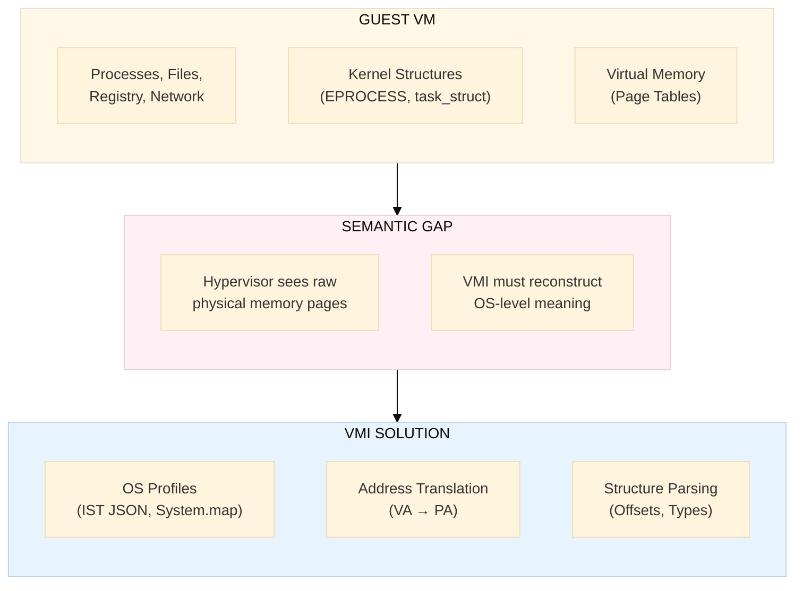
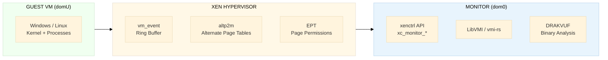
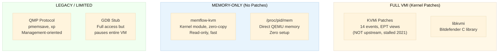
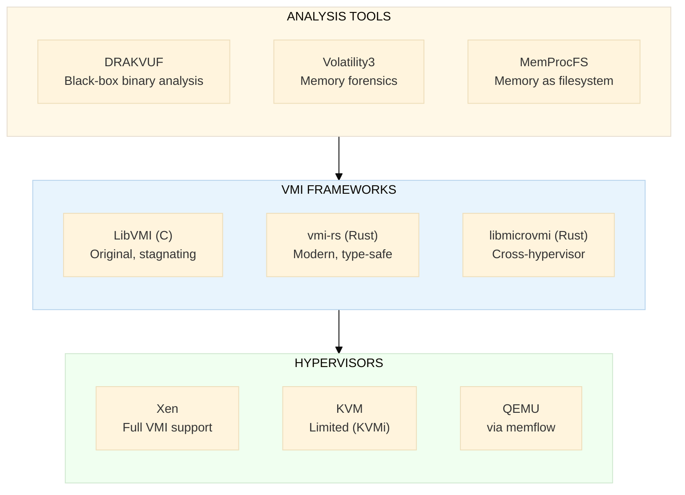

# LibVMI-Rust — Virtual Machine Introspection in Rust

> **Implementation status:** Native Rust VMI workspace with portable core
> contracts, raw/ELF/Xen/KDMP/LiME/manifest artifact parsing, AMD64 and AArch64
> translation, Linux and Windows adapters, a deterministic test provider, a C
> ABI, and capability-limited QEMU, VirtualBox, and Xen providers.
> See the
> [documentation index](docs/README.md) and
> [current implementation](docs/current-implementation.md).

## Documentation

- [Documentation index](docs/README.md)
- [Current implementation](docs/current-implementation.md)
- [Development and verification](docs/development.md)
- [Provider authoring guide](docs/provider-authoring.md)
- [Compatibility policy](docs/compatibility-policy.md)
- [Migration guide](docs/migration.md)
- [Implementation roadmap](implementation-plan.md)
- [Provider support matrix](docs/support-matrix.md)
- [Machine-readable support contract](support-matrix.toml)

## Quick Start

Add the public facade to a Rust 1.85 or newer project:

```toml
[dependencies]
vmi = "0.1"
```

Open an in-memory physical snapshot and read bytes through the same session
contract used by live providers:

```rust
use std::sync::Arc;

use vmi::{
    artifact::SnapshotBundle, driver::DumpConnector, AttachRequest, Capability,
    CapabilitySet, Gpa, GuestArchitecture, VmiSession,
};

let bundle = SnapshotBundle::from_raw(
    "example.raw",
    Gpa::new(0),
    Arc::from([0x56, 0x4d, 0x49, 0x21]),
);
let connector = DumpConnector::new(bundle, GuestArchitecture::Amd64);
let session = VmiSession::attach(
    &connector,
    AttachRequest::any(CapabilitySet::from_caps([Capability::MemoryRead])),
)?;

assert_eq!(session.read_bytes(Gpa::new(0), 4)?, b"VMI!");
# Ok::<(), vmi::VmiError>(())
```

## Why This Research

LibVMI is a foundational C library for **Virtual Machine Introspection (VMI)** — the ability to inspect and manipulate a running virtual machine's memory, registers, and events from *outside* the guest OS, at the hypervisor level. This workspace explores a native Rust design focused on memory safety, explicit provider capabilities, and modern tooling.

This research investigates the current state of LibVMI, the emerging Rust VMI ecosystem, and provides a concrete implementation plan for building a production-grade VMI solution in Rust.

## The Semantic Gap Problem



The hypervisor has full access to a VM's physical memory but sees only raw bytes. **VMI bridges this semantic gap** by parsing guest OS kernel structures, translating virtual addresses, and reconstructing high-level abstractions (processes, modules, network connections) from raw memory.

## Project Structure

```text
libvmi-rust/
├── Cargo.toml                         # Rust workspace root
├── support-matrix.toml                # Machine-readable provider capability matrix
├── crates/
│   ├── vmi-driver-api/                # Provider-facing connector and session traits
│   ├── vmi-testkit/                   # Fake providers and contract tests
│   └── vmi-types/                     # Shared addresses, capabilities, errors, descriptors
├── docs/
│   └── adr/                           # Initial architecture and policy decisions
├── README.md                          # This file — project overview
├── libvmi-overview.md                 # LibVMI architecture, API, limitations
├── rust-vmi-ecosystem.md              # Existing Rust VMI projects and crates
├── kvm-vmi-methods.md                 # KVM introspection: 8 approaches, KVMi API, setup
├── xen-vmi-methods.md                 # Xen introspection: vm_event, altp2m, DRAKVUF, setup
├── kvm-rust-kernel-module.md           # Custom Rust kernel module: ftrace hooks, EPT, MTF, shadow pages
├── implementation-plan.md             # Rust implementation strategy and roadmap
├── project-structure.md               # All .rs files, purposes, dependencies (table format)
└── mindmap.md                         # Visual overview of research areas
```

## LibVMI at a Glance

| Field | Value |
|-------|-------|
| **Repository** | <https://github.com/libvmi/libvmi> |
| **Stars** | ~738 |
| **Language** | C (89%), Python (3.6%) |
| **License** | LGPL-3.0 / GPL-3.0 (dual) |
| **Last Release** | v0.14.0 (December 2020) |
| **Creator** | Bryan D. Payne (Georgia Tech / Sandia Labs) |
| **Maintainer** | Tamas K. Lengyel (Zentific LLC / DRAKVUF) |

### Core Capabilities

| Capability | Description |
|-----------|-------------|
| **Memory Access** | Read/write guest physical and virtual memory |
| **Register Access** | Read/write vCPU registers (CR0, CR3, CR4, MSR, etc.) |
| **Address Translation** | VA → PA, kernel symbol → VA, PID → DTB |
| **Event Handling** | Trap on memory access, register changes, interrupts, CPUID (Xen only) |
| **OS Profiles** | Parse Windows (EPROCESS), Linux (task_struct), FreeBSD kernel structures |
| **VM Control** | Pause/resume guest VMs |

### Hypervisor Support

| Hypervisor | Memory R/W | Registers | Events | Status |
|-----------|-----------|-----------|--------|--------|
| **Xen** | Full | Full | Full (EPT) | Production-ready |
| **KVM** | Yes | Yes | **No** | KVMi patches not upstream |
| **File** | Read-only | N/A | N/A | Offline memory dumps |

## Hypervisor VMI Methods — Summary

### Xen VMI (Production-Grade)

Xen provides the most mature VMI support through its **vm_event** subsystem (upstream since Xen 4.4):



| Feature | Detail |
|---------|--------|
| **Event delivery** | Shared-memory ring buffer (~5-20 us latency) |
| **17 event types** | Memory access, CR/MSR writes, INT3, CPUID, descriptors, debug, guest request |
| **altp2m** | Multiple EPT views for stealthy breakpoints (execute from view A, read from view B) |
| **Domain forking** | Clone VM state for parallel analysis (Xen 4.13+) |
| **DRAKVUF** | Full binary analysis platform built on Xen VMI |
| **Setup** | No kernel patches — vm_event is upstream Xen |
| **Requirement** | Intel VT-x + EPT, Xen hypervisor, dom0 access |

**See**: [xen-vmi-methods.md](xen-vmi-methods.md) for full technical reference.

### KVM VMI (8 Approaches)

KVM lacks upstream VMI support, but 8 introspection methods exist with varying trade-offs:



| Method | Patches? | Memory | Registers | Events | Speed |
|--------|----------|--------|-----------|--------|-------|
| **KVMi** | Yes (77-84 patches) | R/W | R/W | 14 types | Fast (~10-50 us) |
| **memflow-kvm** | Module only | Read | No | No | Very fast (zero-copy) |
| **/proc/pid/mem** | None | Read | No | No | Moderate |
| **QMP** | None | Read (file) | No | No | Very slow |
| **GDB stub** | None | R/W | R/W | Breakpoints | Slow (pauses VM) |
| **/dev/kvm ioctls** | None | Indirect | R/W | No | N/A (QEMU-only) |
| **libkvmi** | Yes | R/W | R/W | 14 types | Fast |
| **kvm-vmi project** | Yes (integrated) | R/W | R/W | 14 types | Fast |

**Why KVMi failed upstream**: 77-84 patches, single consumer (Bitdefender), maintenance burden, security surface concerns, preference for narrower HEKI approach.

**See**: [kvm-vmi-methods.md](kvm-vmi-methods.md) for full technical reference.

### Xen vs KVM — Head-to-Head

| Capability | Xen | KVM (with KVMi) | KVM (without patches) |
|-----------|-----|-----------------|----------------------|
| **Upstream support** | Yes | No (stalled 2021) | N/A |
| **Event delivery** | Ring buffer (5-20 us) | Socket IPC (10-50 us) | None |
| **EPT violation events** | Yes | Yes | No |
| **CR/MSR interception** | Yes | Yes | No |
| **INT3 breakpoints** | Yes | Yes | GDB only |
| **Single-stepping** | Yes | Yes | GDB only |
| **Alternate page tables** | Yes (altp2m, upstream) | Yes (EPT views, patches) | No |
| **CPUID interception** | No | Yes | No |
| **Sub-page protection** | No | Yes (Intel SPP) | No |
| **DRAKVUF support** | Yes | No | No |
| **Domain forking** | Yes (Xen 4.13+) | No | No |
| **Deployment prevalence** | Niche | Dominant (cloud/enterprise) | — |
| **Production VMI tools** | DRAKVUF, HVMI | Bitdefender HVI only | memflow |

> **Recommendation**: For VMI projects, **Xen is the clear choice** — upstream support, mature tooling (DRAKVUF), and lower event latency. KVM VMI remains experimental. For memory-only introspection on KVM, use **memflow-kvm** (no patches needed).

## Why Rust for VMI?

| Reason | Detail |
|--------|--------|
| **Memory Safety** | VMI processes untrusted guest memory — buffer overflows in C parsers are a critical risk |
| **Performance** | vCPU is paused during event processing — every microsecond counts |
| **Type Safety** | Distinguish physical vs virtual addresses at compile time (newtype pattern) |
| **Modern Tooling** | Cargo, crates.io, doc generation, cross-compilation |
| **Ecosystem Momentum** | Cloud Hypervisor, Firecracker, crosvm all use Rust + rust-vmm crates |
| **Cross-Platform** | Single codebase for Xen, KVM, file-mode with feature flags |

## Existing Rust VMI Projects

| Project | Stars | Focus | Hypervisors | Status |
|---------|-------|-------|-------------|--------|
| **[memflow](https://github.com/memflow/memflow)** | 951 | Memory introspection framework | QEMU, KVM, PCILeech | Active, most popular |
| **[libmicrovmi](https://github.com/Wenzel/libmicrovmi)** | 199 | Unified VMI API | Xen, KVM, VBox, memflow | Active, GPL-3.0 |
| **[vmi-rs](https://github.com/vmi-rs/vmi)** | 119 | Full VMI framework | Xen 4.20+ | Active, most comprehensive |
| **[illusion-rs](https://github.com/memN0ps/illusion-rs)** | 350 | Type-1 hypervisor for VMI/RE | Intel VT-x | Archived |
| **[AVML](https://github.com/microsoft/avml)** | 1,100 | Memory acquisition (Linux) | N/A (host tool) | Active (Microsoft) |
| **[kvmi](https://github.com/Wenzel/kvmi)** | 5 | KVM introspection bindings | KVM | Active |

## VMI Ecosystem Map



## Use Cases

| Use Case | Description | Key Requirement |
|----------|-------------|----------------|
| **Malware Analysis** | Execute malware in VM, trace syscalls/file/network without in-guest agent | Event handling (EPT traps) |
| **Rootkit Detection** | Compare hypervisor-visible memory vs guest-reported data | Kernel structure parsing |
| **Digital Forensics** | Live memory acquisition from running VMs | Memory read, OS profiles |
| **Cloud Security** | Agentless monitoring of tenant VMs | Scalability, low overhead |
| **Honeypots** | Nearly undetectable monitoring of attacker activity | Stealth, event handling |
| **IDS/IPS** | Monitor syscall tables, IDT, process lists for tampering | Real-time events |

## Research Goals

1. Document LibVMI's complete architecture, API surface, and limitations
2. Map the Rust VMI ecosystem — frameworks, crates, and hypervisor bindings
3. Design a Rust implementation plan that addresses LibVMI's shortcomings
4. Provide a phased roadmap from FFI bindings to native Rust VMI framework
5. Identify the optimal architecture for production security monitoring use cases
