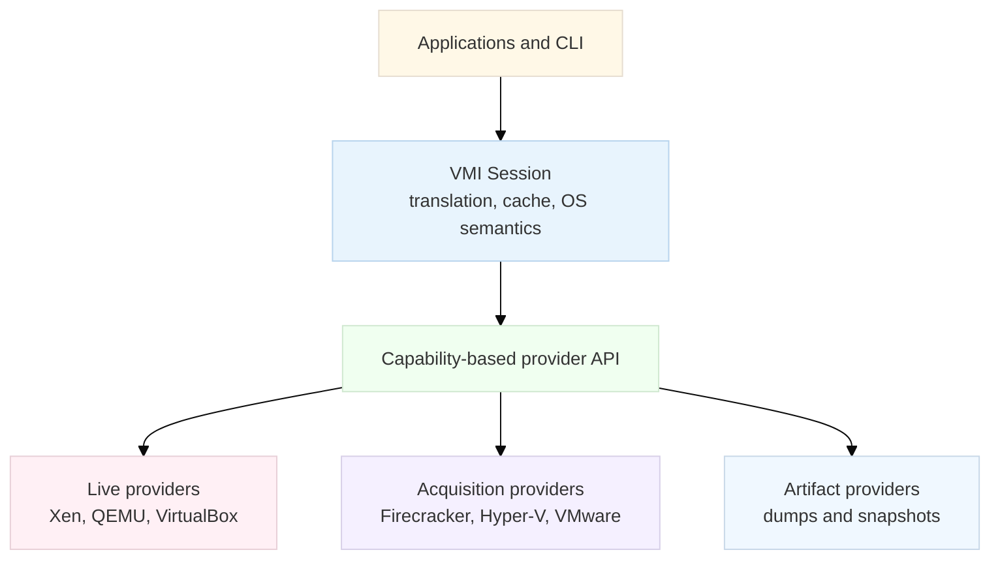

# LibVMI-Rust — Multi-Hypervisor Implementation Plan

- **Status:** Draft for implementation
- **Updated:** 2026-07-14
- **Scope:** Native Rust VMI framework with capability-accurate live, debug, and acquisition providers

This plan supersedes the earlier Xen/KVM/dump-only draft. The repository now has the initial Rust workspace scaffold; the remaining live and acquisition providers are still to be implemented.

## Executive Decision

Build a provider-oriented Rust framework in which each backend advertises only the operations it can actually perform. Do not force every hypervisor to emulate Xen's full VMI model.

The first implementation path is:

1. Prove the contracts with a deterministic fake provider and a normalized offline snapshot model.
2. Deliver stock QEMU/KVM memory inspection, debugging, and snapshot acquisition.
3. Deliver Xen as the reference full-event VMI provider.
4. Add VirtualBox live debugging and Firecracker/Cloud Hypervisor snapshot providers.
5. Add Hyper-V, VMware, and bhyve saved-state/acquisition providers before considering deeper live integration.
6. Keep KVMi and the custom KVM kernel module experimental until they pass a pinned kernel and hardware safety matrix.

This order prioritizes broad, honest coverage while preserving a path to advanced event-based introspection.

## Goals

- Provide one type-safe API across live VMs, debug endpoints, snapshots, and memory dumps.
- Add a new provider without changing the portable core.
- Represent memory read, memory write, registers, VM control, snapshots, events, and memory views as independent capabilities.
- Support Windows and Linux guests on AMD64 first, with AArch64 added through a separate architecture boundary.
- Make consistency explicit: live best-effort, paused, or immutable snapshot.
- Reuse proven Rust ecosystem components where they fit, without exposing their implementation details as the public API.
- Keep privileged, unsafe, native, and vendor-specific code isolated in provider crates.
- Publish a support matrix backed by the same conformance tests used in CI.
- Normalize QEMU, VirtualBox, and Cloud Hypervisor ELF VM cores through one parser with provider-specific CPU-note decoders.

## Non-Goals for the First Release

- Drop-in ABI compatibility with the C LibVMI library.
- Pretending all hypervisors support EPT/NPT events, alternate views, or single-step.
- Dynamic Rust plugins across an unstable Rust ABI.
- Transparent introspection of encrypted guests using SEV, SEV-SNP, TDX, or protected VMs.
- Production support for out-of-tree KVMi or ftrace-based kernel hooks.
- Guest OS write/injection helpers before read-only introspection is stable.

An optional C API and a versioned plugin ABI can be designed after the Rust API reaches stability.

## What “Hypervisor Support” Means

Capability and maturity are separate axes. A provider may be stable for snapshot acquisition but have no live event support.

### Capability Levels

| Level | Name | Required behavior |
| --- | --- | --- |
| L0 | Artifact | Open an immutable memory or state artifact and report its ranges and provenance |
| L1 | Live inspection | Read guest physical memory from a running target; consistency limitations are reported |
| L2 | Debug/control | Add some combination of memory write, CPU state, pause/resume, or snapshots |
| L3 | Full VMI | Deliver guest events with bounded response semantics; may also support memory views |

### Maturity Levels

| Maturity | Release promise |
| --- | --- |
| Supported | Release-blocking conformance, compatibility, integration, and soak tests |
| Preview | Functional and documented, but API or compatibility may change |
| Experimental | Lab-only, feature-gated, and not covered by compatibility guarantees |
| Compile-only | Builds on the platform but is not advertised as functional |

No provider may return placeholder success for an unsupported operation. Capability requirements are checked when attaching to a target, and missing operations fail with a typed error before analysis begins.

## Initial Provider Roadmap

| Provider | Mechanism | Initial capability | Target maturity | Priority |
| --- | --- | --- | --- | --- |
| Synthetic | In-memory deterministic target | L3 for contract testing | Supported internally | P0 |
| Dump | Raw, ELF/vmcore, LiME, Windows KDMP, Xen core | L0, read-only | Supported | P0 |
| QEMU/KVM memory | memflow QEMU/KVM connector or an explicit process-memory connector | L1; writes only after proof | Preview → Supported | P1 |
| QEMU debug | QEMU GDB remote protocol plus QMP control | L2 memory, registers, pause/resume | Preview | P1 |
| QEMU acquisition | QMP `dump-guest-memory` normalized by the ELF VM-core reader | L0/L2 snapshot acquisition | Supported | P1 |
| Xen | Xen control and `vm_event`, preferably through reusable vmi-rs components | L3 including events and memory views | Preview → Supported | P1 |
| VirtualBox | VirtualBox 7.x Main API `IMachineDebugger`, GDB, and `dumpvmcore` | L0/L2 memory, registers, pause/resume; no portable guest events | Preview → Supported | P2 |
| Firecracker | REST API pause/resume and full snapshot memory file | L0/L2 acquisition | Preview | P2 |
| Cloud Hypervisor | REST API pause, snapshot, and ELF coredump | L0/L2 acquisition | Preview | P2 |
| Hyper-V | VM Saved State Dump Provider; optional LiveKd acquisition | L0 memory, CPU state, and translation from saved state | Preview | P3 |
| VMware | vSphere memory snapshot with direct artifact spike or user-supplied `vmss2core` | L0, offline | Preview | P3 |
| bhyve | `bhyvectl --suspend` artifacts and FreeBSD 15 GDB server spike | L0 first; candidate L2 debug | Preview | P3 |
| KVMi | Out-of-tree KVM/QEMU and KVMI protocol | Candidate L3 | Experimental | P4 |
| Custom `vmi-kmod` | Version-pinned kernel hooks and userspace protocol | Candidate L3 | Experimental | P4 |

Firecracker and Cloud Hypervisor are KVM-based VMMs, not new hardware hypervisors. They still need separate providers because their control APIs, snapshot workflows, target discovery, and artifact formats differ from QEMU.

### Explicit Constraints

- `kvm-ioctls` is not an external attach API. VM and vCPU file descriptors belong to the VMM process that created them. Stock KVM support must use a connector, a cooperative VMM integration, a debug endpoint, or an acquisition workflow.
- Windows Hypervisor Platform APIs operate on a partition handle owned by the calling virtualization stack. They are useful for cooperative/owned partitions, not arbitrary attachment to an existing Hyper-V-managed VM.
- Hyper-V, VMware, and bhyve are not described as full live VMI until a supported external API proves the required contracts.
- Optional vendor tools such as LiveKd and `vmss2core` are discovered on the host and invoked as user-supplied dependencies; they are not redistributed by this project.
- One memflow KVM connector can serve QEMU, Firecracker, and Cloud Hypervisor live memory when their KVM memslots are discoverable; VMM-specific control and artifact acquisition remain separate providers.
- The custom `vmi-kmod` remains research-only through v1.0 and requires a separate product/security ADR before implementation.

## Architecture



### Architectural Boundaries

| Boundary | Responsibility | Must not contain |
| --- | --- | --- |
| Types | Guest addresses, target IDs, capability descriptions, errors, provenance | OS or hypervisor assumptions |
| Provider API | Enumeration, attachment, raw memory, CPU state, control, event, and acquisition contracts | Page-table or OS parsing |
| Architecture | Registers, translation roots, endianness, page-table walking | Hypervisor handles |
| Core/session | Page-spanning reads, consistency, cache generations, translation, lifecycle guards | Vendor FFI |
| OS/profile | Windows/Linux symbols and structure interpretation | Hypervisor-specific code |
| Provider | Target discovery and transport-specific implementation | Cross-provider policy |
| Facade/CLI | Ergonomic API, configuration, output, orchestration | Raw unsafe FFI |

### Core Contract Shape

The exact signatures are finalized in an ADR, but the model should follow this shape:

```rust
pub trait Connector: Send + Sync {
    fn enumerate(&self) -> Result<Vec<TargetDescriptor>, VmiError>;

    fn attach(
        &self,
        target: TargetSelector,
        required: CapabilityRequirements,
        options: AttachOptions,
    ) -> Result<Box<dyn SessionBackend>, VmiError>;
}

pub trait SessionBackend: Send + Sync {
    fn descriptor(&self) -> &TargetDescriptor;
    fn capabilities(&self) -> &Capabilities;
    fn memory_reader(&self) -> Option<&dyn PhysicalMemoryRead>;
    fn memory_writer(&self) -> Option<&dyn PhysicalMemoryWrite>;
    fn cpu_state(&self) -> Option<&dyn CpuStateAccess>;
    fn control(&self) -> Option<&dyn VmControl>;
    fn events(&self) -> Option<&dyn EventChannel>;
    fn memory_views(&self) -> Option<&dyn MemoryViewControl>;
    fn acquisition(&self) -> Option<&dyn AcquireArtifact>;
    fn lifecycle(&self) -> Option<&dyn TargetLifecycle>;
}
```

The provider API is object-safe for runtime selection. Higher-level helpers may use generic capability bounds where compile-time enforcement improves ergonomics.

### Required Capability Traits

- `PhysicalMemoryRead`: sparse memory map plus exact and vectored reads.
- `PhysicalMemoryWrite`: explicit mutation, never implied by read access.
- `CpuStateAccess`: architecture-tagged single-vCPU and coherent bulk snapshots.
- `VmControl`: pause/resume with ownership-aware RAII guards.
- `AcquireArtifact`: produce an immutable artifact set with provenance and consistency metadata.
- `EventChannel`: subscribe, receive, and respond exactly once within a declared deadline.
- `MemoryViewControl`: portable view creation/switching; Xen maps this to altp2m.
- `TargetLifecycle`: generation, reconnect, reboot, destroy, and hotplug notifications where available.

### Data and Correctness Rules

- Use `Gva`, `Gpa`, and `TranslationRoot` or equivalent architecture-neutral types. Do not use one ambiguous integer for guest virtual, guest physical, and host physical addresses.
- Model RAM as ordered sparse ranges. A single `max_physical_address` is insufficient because guests contain holes, MMIO ranges, and hotplug regions.
- Split reads at page and region boundaries. Translating only the first virtual address is incorrect for non-contiguous pages.
- Return typed short-read and memory-hole errors. Never silently zero-fill inaccessible memory.
- Restrict typed reads to safe byte-conversion traits and explicit guest endianness. Do not construct arbitrary `T: Copy` values with `ptr::read_unaligned`.
- Tag caches with target identity and a session generation. Invalidate on writes, event responses, view switches, reboot, reconnect, and memory topology changes.
- Record every session's consistency as `LiveBestEffort`, `Paused`, or `Snapshot` and expose it to callers.
- Default attachment is read-only. Writes and disruptive control require explicit options and a target policy.
- Encrypted or protected guests fail closed with a dedicated unsupported/protected-memory error.

### Normalized Snapshot Model

All offline and acquired state should normalize into a `SnapshotBundle` containing:

- Sparse guest-physical memory ranges.
- Optional architecture-tagged per-vCPU state.
- Guest architecture, page size, and byte order.
- Source provider, source version, target identity, timestamps, and hashes.
- Consistency level and the pause/acquisition procedure used.
- Raw provider notes retained for forward compatibility.

Implement a generic ELF VM-core reader before separate QEMU, VirtualBox, and Cloud Hypervisor dump parsers. ELF `PT_LOAD` segments become guest-physical ranges, while pluggable note decoders translate QEMU, VirtualBox, and Cloud Hypervisor CPU notes. Firecracker, Windows KDMP, LiME, Xen core, VMware artifacts/conversions, Hyper-V saved state or LiveKd output, and bhyve state feed the same `SnapshotBundle` through their respective readers.

This shared seam gives multiple providers one tested memory, CPU-state, provenance, and OS-analysis path.

### Event Rules

- Portable event kinds and portable response actions are distinct from backend extensions.
- A Xen-specific altp2m action becomes portable `SwitchMemoryView(ViewId)`; provider-only actions are namespaced and versioned.
- An event token must be answered exactly once. Drop, panic, timeout, and disconnect paths must have a tested fail-safe response so a vCPU is not left blocked.
- The core event primitive is runtime-neutral and synchronous or file-descriptor driven. Tokio and other async integrations live in optional adapter crates.
- Capability negotiation includes supported event kinds, response actions, maximum queue depth, ordering guarantees, and response deadline.

## Proposed Workspace

Create crates only when their milestone begins. The initial workspace should stay small.

| Crate | Purpose | Initial milestone |
| --- | --- | --- |
| `vmi-types` | Portable addresses, target metadata, capabilities, errors, provenance | M1 |
| `vmi-driver-api` | Connector, session, memory, CPU, control, event, view, acquisition traits | M1 |
| `vmi-arch-api` | Architecture and translation contracts | M1 |
| `vmi-arch-amd64` | AMD64 CPU state and page-table translation | M1 |
| `vmi-core` | Reads, translation, caches, consistency, lifecycle guards | M1 |
| `vmi-testkit` | Fake provider, conformance suites, page-table builders, fault injection | M1 |
| `vmi-artifact` | `SnapshotBundle`, generic ELF VM-core reader, manifests, note-decoder API | M1 |
| `vmi-driver-dump` | Raw, KDMP, LiME, Xen-core, and normalized snapshot connector | M1 |
| `vmi-profile` | Symbol/profile loading and normalized metadata | M1/M2 |
| `vmi-os-windows` | Windows guest semantics | M1/M2 |
| `vmi-os-linux` | Linux guest semantics | M1/M2 |
| `vmi-driver-qemu` | QMP, GDB, and QEMU target configuration | M2 |
| `vmi-driver-memflow` | memflow connector adapter | M2 |
| `vmi-events` | Portable event loop and optional async adapters | M3 |
| `vmi-driver-xen` | Xen live/event provider | M3 |
| `vmi-driver-virtualbox` | VirtualBox Main API provider | M4 |
| `vmi-driver-firecracker` | Firecracker snapshot/control provider | M4 |
| `vmi-driver-cloud-hypervisor` | Cloud Hypervisor snapshot/control provider | M4 |
| `vmi-driver-hyperv` | VM Saved State Dump Provider adapter and optional LiveKd acquisition | M5 |
| `vmi-driver-vmware` | vSphere/Workstation snapshot acquisition provider | M5 |
| `vmi-driver-bhyve` | bhyve suspend artifact provider | M5 |
| `vmi` | Ergonomic facade and selected re-exports | M1 onward |
| `vmi-cli` | Target listing, capabilities, acquisition, reads, translation, and process listing | M1 onward |

Native bindings belong in narrowly scoped `*-sys` crates only when generated or handwritten bindings cannot stay private to a provider.

## Reuse and Dependency Strategy

- Evaluate vmi-rs as the reference implementation and a reusable dependency for Xen, architecture, ISR profiles, and OS semantics. Prefer an adapter or upstream contribution over copying code.
- Use memflow behind `vmi-driver-memflow` for its supported QEMU/KVM connectors. Do not expose memflow types through the public facade.
- Treat libmicrovmi as a design and interoperability reference, not a default dependency, because its GPL-3.0 license would affect distribution choices.
- Do not depend on the C LibVMI core. Minimal provider-specific FFI is allowed when the hypervisor exposes only a C, COM/XPCOM, or native platform API.
- Start with statically linked provider crates and Cargo features. If runtime plugins become necessary, define a versioned C ABI or WIT boundary; never pass Rust trait objects across arbitrary dynamic-library versions.
- Propose MIT OR Apache-2.0 for new portable crates, subject to the Phase M0 licensing ADR and dependency audit.

## Milestones and Gates

Estimates are relative ranges for one experienced engineer and exclude hardware-lab procurement. Parallel provider work can shorten elapsed time after M1 stabilizes the contracts.

### M0 — Architecture and Feasibility Spikes (1–2 weeks)

Deliverables:

- ADR: product scope, native Rust API, and deferred C ABI.
- ADR: capability model, consistency model, and mutation policy.
- ADR: vmi-rs/memflow reuse, licensing, MSRV, and unsafe-code policy.
- ADR: provider configuration, target discovery, and no-default process scanning.
- Machine-readable `support-matrix.toml` schema used by docs and CI.
- Small proof-of-concept for vmi-rs, memflow QEMU/KVM, QEMU QMP/GDB, Xen attach, and VirtualBox Main API.
- Format spike proving QEMU, VirtualBox, and Cloud Hypervisor ELF cores can share `PT_LOAD` parsing with separate CPU-note decoders.
- Feasibility notes for Firecracker, Cloud Hypervisor, Hyper-V saved state/LiveKd, VMware artifacts/`vmss2core`, and bhyve artifacts.

Exit gate:

- Every planned provider maps to explicit capabilities and a supported external mechanism.
- No core trait requires an operation that dumps or memory-only providers must fake.
- License and redistribution constraints are recorded before dependencies or generated bindings are committed.

### M1 — Portable Core and Offline Vertical Slice (3–4 weeks)

Deliverables:

- Cargo workspace, baseline CI, facade, CLI, and documentation skeleton.
- `vmi-types`, `vmi-driver-api`, `vmi-arch-api`, `vmi-arch-amd64`, `vmi-core`, `vmi-artifact`, and `vmi-testkit`.
- Deterministic synthetic provider with sparse memory, multiple vCPUs, events, faults, and lifecycle transitions.
- `SnapshotBundle`, generic ELF VM-core parser, raw dump, plus one Windows/Xen structured format.
- QEMU, VirtualBox, and Cloud Hypervisor note-decoder fixtures, even if their live providers arrive later.
- Correct page-spanning AMD64 translation, huge pages, LA57, PCID-bearing roots, and sparse range handling.
- Safe typed scalar helpers with explicit byte order.
- Minimal profile and Windows/Linux read-only OS adapters, reusing vmi-rs components where the M0 ADR approves them.
- First end-to-end command: open artifact, display capabilities, translate an address, read memory, and list processes from a pinned profile.

Exit gate:

- Core contracts pass unit, property, compile-fail, Miri, concurrency, and malformed-artifact tests.
- Dump results are differentially checked against an independent implementation.
- The same core queries produce equivalent results from at least two independently generated ELF VM cores.
- No arbitrary typed `T: Copy` memory decoding remains.

### M2 — Stock QEMU/KVM Inspection and Acquisition (3–5 weeks)

Deliverables:

- Explicit QMP endpoint configuration and target metadata.
- memflow QEMU/KVM adapter for live physical memory reads.
- QEMU GDB provider for physical memory, CPU registers, and intrusive debug control.
- QMP acquisition workflow that stops or pauses when requested, creates an artifact, verifies completion, and restores the original run state.
- QEMU ELF output normalized into `SnapshotBundle` without a QEMU-specific memory parser.
- Session consistency and provenance surfaced in the CLI.
- Multi-VM isolation, reconnect, VMM exit, reboot, and memory-hotplug handling.

Exit gate:

- Each transport passes only the capability suites it advertises.
- Known-pattern reads, cross-page translations, and process results match the M1 dump reference.
- Direct connector performance has a recorded baseline and no unexplained regression greater than 10% in the same lab.

### M3 — Xen Full VMI Reference Provider (4–6 weeks)

Deliverables:

- Xen target discovery, memory, CPU state, pause guard, and lifecycle implementation.
- `vm_event` subscription/response path with portable event types.
- Memory-access, register-write, interrupt, and single-step coverage supported by the selected Xen versions.
- Memory-view abstraction mapped to altp2m.
- Runtime-neutral event core plus optional Tokio adapter.
- Panic, timeout, queue-backpressure, and disconnect recovery.

Exit gate:

- End-to-end guest trigger tests prove event delivery and exactly-once responses.
- A failed handler cannot leave the VM paused or a vCPU blocked.
- Minimum and newest supported Xen versions pass a release-candidate soak test.

### M4 — VirtualBox and KVM MicroVM Providers (4–6 weeks)

Deliverables:

- VirtualBox 7.x provider using supported Main API operations for memory, registers, VM control, GDB, and VM-core acquisition.
- Firecracker pause/full-snapshot/acquire/resume workflow.
- Cloud Hypervisor pause/snapshot-or-ELF-coredump/acquire/resume workflow.
- Artifact manifests that preserve VMM version, architecture, memory layout, CPU-state source, and consistency.
- AArch64 offline translation spike and promotion plan for Firecracker/Cloud Hypervisor artifacts.

Exit gate:

- VirtualBox passes L1/L2 conformance on every advertised host.
- MicroVM artifacts produce the same OS-level results as equivalent live reads.
- API failures restore the original VM state or report a typed incomplete-recovery error.

### M5 — Hyper-V, VMware, and bhyve Acquisition (4–6 weeks)

Deliverables:

- Hyper-V saved-state location and import through Microsoft's VM Saved State Dump Provider, with optional LiveKd acquisition for Windows guests.
- VMware vSphere/Workstation memory snapshot orchestration, a direct `.vmem` plus `.vmss`/`.vmsn` feasibility path, and optional user-supplied `vmss2core` conversion.
- bhyve suspend artifact discovery and parsing or conversion, plus a FreeBSD 15 GDB debug-provider feasibility gate.
- External-tool version checks, structured subprocess execution, timeouts, cancellation, logs, provenance, and cleanup.
- Clear platform/guest restrictions in the generated support matrix.

Exit gate:

- Each provider creates a reproducible immutable artifact and never claims unsupported live capabilities.
- Tests cover missing tools, incompatible versions, permission failures, partial files, cancellation, and cleanup.
- No vendor binary is bundled or downloaded implicitly.

### M6 — v1.0 Hardening and Release Qualification (4–8 weeks)

Deliverables:

- Stable facade, semver policy, migration guide, provider authoring guide, and complete examples.
- Machine-generated public support matrix and compatibility policy.
- Performance baselines for memory throughput, translation, attach, acquisition, and event latency.
- Security review of dump parsers, privileged control paths, FFI, and subprocess integrations.
- Release-candidate hardware matrix and 24-hour soak tests.
- Decision on AArch64 promotion and a post-v1 C/plugin API roadmap.

Exit gate:

- All supported rows in `support-matrix.toml` are green in release CI.
- Preview and experimental providers are visibly separated in code, docs, and packages.
- No known soundness issue, silent data corruption, stuck VM state, or cross-target cache/handle leakage remains.

## Verification Strategy

### Provider Contract Suites

`vmi-testkit` supplies reusable suites selected from advertised capabilities:

- Memory: zero-length, unaligned, cross-page, sparse, short, overflowing, above-4-GiB, and out-of-range reads.
- Write: read-after-write, permission denial, failed-write behavior, and cache invalidation.
- CPU state: invalid vCPU, single vs bulk consistency, architecture/version decoding.
- Control: nested pause guards, original-state restoration, cancellation, and `Drop` cleanup.
- Lifecycle: multiple targets, reboot, reconnect, destroy, VMM exit, and hotplug.
- Acquisition: provenance, atomic publication, consistency, cancellation, partial-artifact cleanup, and original-state restoration.
- Events: subscription identity, clear behavior, timeouts, ordering, backpressure, exactly-once response, and cleanup.
- Capabilities: every reported operation works; every missing operation fails before use.

### Fixture Policy

Each checked-in fixture has a manifest with:

- SHA-256, license, provenance, and generator version.
- Guest architecture, endianness, page size, and physical ranges.
- Known translations, symbols, processes, modules, and CPU state where applicable.
- Expected parser failures for malformed fixtures.

Use small generated fixtures in pull-request CI. Store large or licensed Windows images in immutable private CI artifacts, not Git. Preserve every property-test or fuzz failure as a regression seed.

### CI Layers

Pull-request CI:

- `rustfmt`, Clippy with warnings denied, docs, doctests, unit/property tests, and compile-fail tests.
- Stable Rust plus the declared MSRV.
- `--no-default-features`, each portable provider independently, and valid feature powersets.
- Linux, Windows, and macOS for portable core and dump providers.
- Dependency advisory/license policy and public API semver checks.

Nightly CI:

- Miri for portable core and safe wrapper logic.
- Sanitizers for native and FFI providers.
- Fuzzing of artifact parsers, page tables, profiles, QMP/GDB decoders, and event messages.
- Loom or model tests for caches, event queues, pause ownership, and lifecycle synchronization.
- Generated binding and vendor API drift checks.

Privileged self-hosted lab:

- Xen minimum/newest versions, stock QEMU/KVM on Intel and AMD, VirtualBox on advertised hosts, Hyper-V on Windows, VMware in its supported environment, and bhyve on FreeBSD.
- Ephemeral or resettable runners; untrusted fork code is never executed on privileged hosts.
- Guest harnesses that expose known memory patterns and trigger supported event types.
- Multi-VM, large-memory, reboot, reconnect, hotplug, forced failure, one-hour nightly stress, and 24-hour release-candidate soak.

### Unsafe and FFI Policy

- `unsafe_code = "forbid"` in portable crates.
- Permit unsafe code only in narrowly scoped provider or `*-sys` crates.
- Deny `unsafe_op_in_unsafe_fn`; every unsafe block needs a documented invariant.
- Compare FFI structure layout against a small native program for every supported vendor/header version.
- Use RAII for file descriptors, mappings, hypervisor handles, event registrations, and paused VMs.
- Catch panics before C callbacks or other foreign boundaries; never unwind across FFI.
- Maintain an explicit unsafe-code inventory reviewed before each release.

## Provider Definition of Done

A provider is not complete merely because it can read one VM. It must include:

1. Target selection and deterministic configuration.
2. Immutable capability and version reporting.
3. Permission requirements and least-privilege setup documentation.
4. Exact consistency and side-effect semantics.
5. Typed error mapping with backend operation context.
6. Contract-suite selection based on its capabilities.
7. At least one positive hardware/integration path and negative failure paths.
8. Cleanup, cancellation, reconnect, multi-target isolation, and resource-leak tests.
9. Compatibility range and generated support-matrix entry.
10. A minimal example and CLI smoke test.

## Major Risks and Mitigations

| Risk | Impact | Mitigation |
| --- | --- | --- |
| Vendor exposes no supported external live API | A requested provider cannot offer live VMI | Ship an acquisition provider and label its capability accurately |
| KVM event support remains out of tree | No portable full-event KVM backend | Keep Xen as L3 reference; feature-gate KVMi and kernel hooks |
| Live memory changes during analysis | Silent semantic corruption | Expose consistency, use pause/snapshot when available, test heartbeat/counter invariants |
| Native API or ABI drift | Build failures or unsafe memory corruption | Isolated sys crates, version checks, layout tests, pinned compatibility matrix |
| Dynamic Rust plugin ABI instability | Crashes across compiler versions | Static providers first; later versioned C ABI or WIT |
| Vendor tool redistribution restrictions | Legal and operational risk | Require user-supplied tools; record versions and provenance |
| Privileged CI compromise | Host or lab compromise | Ephemeral isolated runners; never run untrusted fork code |
| Untrusted dump/profile input | Parser panic, OOM, or code execution | Bounds, limits, fuzzing, Miri/sanitizers, fail-closed parsing |
| Architecture leaks from AMD64 | AArch64 cannot be added cleanly | Architecture-neutral core types and separate translation/CPU crates from M1 |
| Scope expands into every VMM at once | Core never stabilizes | Gate new providers behind M1 contracts and priority order |

## Working Assumptions Requiring an ADR

- The public API is native Rust; C LibVMI compatibility is deferred.
- Broad read-only and acquisition coverage comes before write/injection features.
- AMD64 Windows/Linux guests are the first supported guest matrix.
- New portable crates use a permissive license, proposed MIT OR Apache-2.0.
- Static provider crates are sufficient through v1.0.
- VirtualBox is the first non-Xen/non-KVM live provider.
- Hyper-V, VMware, and bhyve begin as saved-state/acquisition providers.
- KVMi and `vmi-kmod` cannot block v1.0.

## v1.0 Success Criteria

- One stable Rust facade and provider-authoring contract.
- Supported dump/artifact analysis with safe AMD64 translation and Windows/Linux process enumeration.
- Supported QEMU/KVM live memory plus QEMU acquisition.
- Supported Xen live memory, CPU state, VM control, and events.
- At least preview-quality VirtualBox live memory/register/control support.
- Preview-quality Firecracker and Cloud Hypervisor acquisition.
- Hyper-V, VMware, and bhyve acquisition either preview-quality or explicitly deferred with completed feasibility evidence.
- Capability claims generated from passing tests rather than manually maintained marketing tables.
- No default mutation, no implicit vendor-tool download, and no silent fallback from consistent to best-effort analysis.

## Immediate First Pull Request After Plan Approval

The first implementation pull request should contain only:

- Workspace and CI skeleton.
- M0 ADR templates and initial decisions.
- `support-matrix.toml` schema with the provider rows above.
- `vmi-types`, `vmi-driver-api`, and `vmi-testkit` skeletons.
- A fake read-only provider and one contract test proving missing capabilities fail at attach time.

This pull request validates the extensibility boundary before backend-specific code begins.

## Primary References

- [vmi-rs: modular Rust VMI framework](https://github.com/vmi-rs/vmi)
- [memflow connectors and plugin model](https://github.com/memflow/memflow)
- [libmicrovmi cross-hypervisor reference](https://github.com/Wenzel/libmicrovmi)
- [QEMU Machine Protocol reference](https://www.qemu.org/docs/master/interop/qemu-qmp-ref.html)
- [QEMU GDB physical-memory mode](https://www.qemu.org/docs/master/system/gdb.html)
- [VirtualBox 7.2 SDK reference](https://download.virtualbox.org/virtualbox/7.2.0/SDKRef.pdf)
- [VirtualBox 7.2 VM debugger and core format](https://docs.oracle.com/en/virtualization/virtualbox/7.2/user/Troubleshooting.html)
- [Firecracker snapshot support](https://github.com/firecracker-microvm/firecracker/blob/main/docs/snapshotting/snapshot-support.md)
- [Cloud Hypervisor HTTP API](https://github.com/cloud-hypervisor/cloud-hypervisor/blob/main/docs/api.md)
- [memflow-kvm connector source](https://github.com/memflow/memflow-kvm)
- [Microsoft VM Saved State Dump Provider](https://learn.microsoft.com/en-us/virtualization/api/vm-dump-provider/reference/reference)
- [Microsoft Sysinternals LiveKd](https://learn.microsoft.com/en-us/sysinternals/downloads/livekd)
- [VMware `vmss2core` guidance](https://knowledge.broadcom.com/external/article/323788/converting-a-snapshot-file-to-memory-dum.html)
- [FreeBSD bhyve snapshot documentation](https://docs.freebsd.org/en/books/handbook/virtualization/)
- [FreeBSD 15 bhyve manual](https://man.freebsd.org/cgi/man.cgi?query=bhyve&sektion=8&manpath=FreeBSD+15.0-RELEASE)
