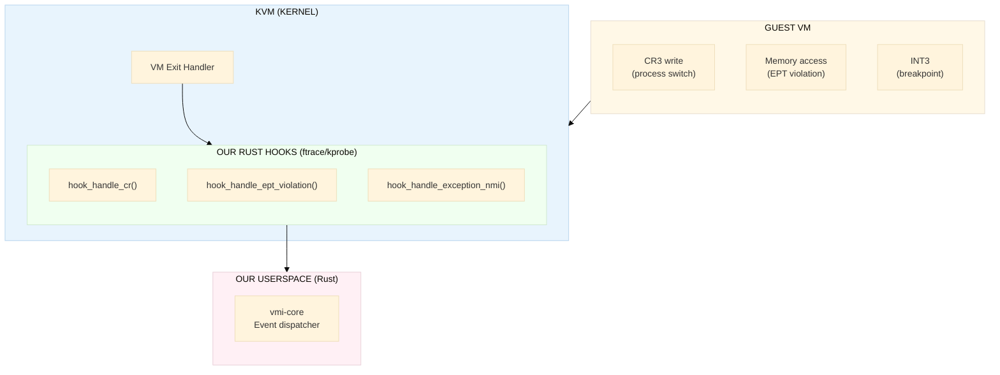

# KVM VMI — Custom Rust Kernel Module (Zero Patches)

## Problem Statement

KVM lacks upstream VMI support. The KVMi patch series (77+ patches) has been stalled since 2021 and will likely never be merged. Existing solutions like memflow-kvm provide memory read-only — no event trapping, no CR interception, no breakpoints.

This document describes how to build a **Rust kernel module** that provides full KVMi-equivalent capabilities by hooking KVM internals via ftrace, with zero kernel source patches.

## Architecture



## Core Technique: ftrace + kallsyms

Linux provides **ftrace** — a kernel function tracing framework that lets modules hook any kernel function at runtime. Combined with `kallsyms_lookup_name()`, we can hook KVM internal functions without patching anything.

### How ftrace Hooking Works

```text
1. kallsyms_lookup_name("handle_ept_violation") → 0xffffffff81234567
2. ftrace_set_filter_ip(ops, 0xffffffff81234567)
3. register_ftrace_function(ops)
4. Every call to handle_ept_violation() now goes through our hook first
5. Our hook reads VMCS fields, sends event, calls original function
```

**Why this works**: ftrace is a stable, upstream kernel API used by perf, bpftrace, and systemtap. It's not a hack — it's the intended mechanism for function-level hooking in the Linux kernel.

### KVM Functions We Hook

| KVM Function | Location | VM Exit Reason | What We Capture |
|-------------|----------|----------------|----------------|
| `handle_ept_violation()` | `arch/x86/kvm/vmx/vmx.c` | EPT violation | GPA, GVA, access type (R/W/X) |
| `handle_cr()` | `arch/x86/kvm/vmx/vmx.c` | CR access | CR number, old/new value |
| `handle_exception_nmi()` | `arch/x86/kvm/vmx/vmx.c` | Exception | INT3 breakpoints, debug exceptions |
| `handle_monitor_trap()` | `arch/x86/kvm/vmx/vmx.c` | MTF exit | Single-step completed (RIP) |
| `handle_cpuid()` | `arch/x86/kvm/vmx/vmx.c` | CPUID | Leaf/subleaf values |
| `handle_desc()` | `arch/x86/kvm/vmx/vmx.c` | Descriptor access | GDT/LDT/IDT/TR modifications |

---

## Component 1: EPT Violation Hooks

Trap on guest memory access — the most critical VMI capability.

### VMCS Fields Read

| VMCS Field | Encoding | Content |
|-----------|----------|---------|
| `GUEST_PHYSICAL_ADDRESS` | 0x2400 | GPA that caused the violation |
| `EXIT_QUALIFICATION` | 0x6400 | Access type bits (R/W/X) |
| `GUEST_LINEAR_ADDRESS` | 0x640A | GVA (if available) |

### Implementation

```rust
// vmi-kmod/src/ept_hooks.rs

struct EptViolationHook {
    ftrace_ops: FtraceOps,
    original_fn: unsafe extern "C" fn(*mut KvmVcpu) -> i32,
}

impl EptViolationHook {
    fn install() -> Result<Self> {
        let addr = kallsyms_lookup_name("handle_ept_violation")?;
        let ops = ftrace_register(addr, Self::hook_handler)?;
        Ok(Self { ftrace_ops: ops, original_fn: addr })
    }

    unsafe extern "C" fn hook_handler(vcpu: *mut KvmVcpu) -> i32 {
        let gpa = vmcs_read64(GUEST_PHYSICAL_ADDRESS);
        let exit_qual = vmcs_read64(EXIT_QUALIFICATION);
        let gva = vmcs_read64(GUEST_LINEAR_ADDRESS);

        let access = MemAccess {
            read:    exit_qual & (1 << 0) != 0,
            write:   exit_qual & (1 << 1) != 0,
            execute: exit_qual & (1 << 2) != 0,
        };

        // Send event to userspace via shared ring buffer
        event_ring_push(VmiEvent::EptViolation {
            gpa,
            gva,
            access,
            vcpu_id: (*vcpu).vcpu_id,
        });

        // Call original KVM handler
        (self.original_fn)(vcpu)
    }
}
```

### EPT Page Permission Control

To trigger EPT violations, we modify EPT page table entries to remove permissions:

```rust
// vmi-kmod/src/ept_access.rs

/// EPT permission bits
const EPT_READ:    u64 = 1 << 0;
const EPT_WRITE:   u64 = 1 << 1;
const EPT_EXECUTE: u64 = 1 << 2;

struct EptAccessController;

impl EptAccessController {
    /// Set access permissions on a guest physical page
    unsafe fn set_page_access(
        vcpu: *mut KvmVcpu,
        gfn: u64,
        access: MemAccess,
    ) -> Result {
        let eptp = vmcs_read64(EPT_POINTER);
        let ept_root = eptp & 0x000F_FFFF_FFFF_F000;

        // Walk EPT: PML4 → PDPT → PD → PT
        let pte = ept_walk_to_pte(ept_root, gfn)?;

        // Clear permission bits
        let mut entry = *pte & !(EPT_READ | EPT_WRITE | EPT_EXECUTE);

        // Set requested permissions
        if access.read    { entry |= EPT_READ; }
        if access.write   { entry |= EPT_WRITE; }
        if access.execute { entry |= EPT_EXECUTE; }

        *pte = entry;

        // Flush EPT TLB for this context
        invept_single_context(eptp);

        Ok(())
    }

    /// Walk EPT page tables to find PTE for a given GFN
    unsafe fn ept_walk_to_pte(ept_root: u64, gfn: u64) -> Result<*mut u64> {
        let gpa = gfn << 12;

        // PML4
        let pml4_idx = (gpa >> 39) & 0x1FF;
        let pml4e_ptr = (ept_root + pml4_idx * 8) as *mut u64;
        let pml4e = read_physical(pml4e_ptr);
        if pml4e & EPT_READ == 0 { return Err(ENOENT); }

        // PDPT
        let pdpt_base = pml4e & 0x000F_FFFF_FFFF_F000;
        let pdpt_idx = (gpa >> 30) & 0x1FF;
        let pdpte_ptr = (pdpt_base + pdpt_idx * 8) as *mut u64;
        let pdpte = read_physical(pdpte_ptr);
        if pdpte & EPT_READ == 0 { return Err(ENOENT); }
        if pdpte & (1 << 7) != 0 { return Ok(pdpte_ptr); } // 1GB page

        // PD
        let pd_base = pdpte & 0x000F_FFFF_FFFF_F000;
        let pd_idx = (gpa >> 21) & 0x1FF;
        let pde_ptr = (pd_base + pd_idx * 8) as *mut u64;
        let pde = read_physical(pde_ptr);
        if pde & EPT_READ == 0 { return Err(ENOENT); }
        if pde & (1 << 7) != 0 { return Ok(pde_ptr); } // 2MB page

        // PT
        let pt_base = pde & 0x000F_FFFF_FFFF_F000;
        let pt_idx = (gpa >> 12) & 0x1FF;
        let pte_ptr = (pt_base + pt_idx * 8) as *mut u64;

        Ok(pte_ptr)
    }
}
```

---

## Component 2: CR Write Interception

Intercept writes to control registers (CR0, CR3, CR4). CR3 writes indicate process context switches.

```rust
// vmi-kmod/src/cr_hooks.rs

struct CrWriteHook {
    ftrace_ops: FtraceOps,
    original_fn: unsafe extern "C" fn(*mut KvmVcpu) -> i32,
}

impl CrWriteHook {
    fn install() -> Result<Self> {
        // Hook: arch/x86/kvm/vmx/vmx.c → handle_cr()
        let addr = kallsyms_lookup_name("handle_cr")?;
        let ops = ftrace_register(addr, Self::hook_handler)?;
        Ok(Self { ftrace_ops: ops, original_fn: addr })
    }

    unsafe extern "C" fn hook_handler(vcpu: *mut KvmVcpu) -> i32 {
        let exit_qual = vmcs_read64(EXIT_QUALIFICATION);
        let cr_num = (exit_qual & 0xF) as u8;              // CR0, CR3, CR4
        let access_type = ((exit_qual >> 4) & 0x3) as u8;  // 0=MOV to CR
        let reg_idx = ((exit_qual >> 8) & 0xF) as u8;      // Source GP register

        if access_type == 0 {  // Write to CR
            let new_value = vcpu_read_gp_reg(vcpu, reg_idx);
            let old_value = match cr_num {
                0 => vmcs_read64(GUEST_CR0),
                3 => vmcs_read64(GUEST_CR3),
                4 => vmcs_read64(GUEST_CR4),
                _ => 0,
            };

            event_ring_push(VmiEvent::CrWrite {
                cr: cr_num,
                old_value,
                new_value,
                vcpu_id: (*vcpu).vcpu_id,
            });
        }

        // Call original handler
        (self.original_fn)(vcpu)
    }
}

/// Enable CR3-exit interception in VMCS
/// By default KVM may not trap all CR3 writes
unsafe fn enable_cr3_interception(vcpu: *mut KvmVcpu) {
    let cpu_exec = vmcs_read32(CPU_BASED_VM_EXEC_CONTROL);
    vmcs_write32(
        CPU_BASED_VM_EXEC_CONTROL,
        cpu_exec | CR3_LOAD_EXITING | CR3_STORE_EXITING
    );
}
```

---

## Component 3: Single-Stepping via Monitor Trap Flag

The Monitor Trap Flag (MTF) causes a VM exit after executing exactly one guest instruction.

```rust
// vmi-kmod/src/singlestep.rs

/// VMCS field for CPU-based execution controls
const CPU_BASED_VM_EXEC_CONTROL: u32 = 0x4002;
const MONITOR_TRAP_FLAG: u32 = 1 << 27;

struct SingleStepController;

impl SingleStepController {
    /// Enable single-stepping on a vCPU by setting MTF in VMCS
    unsafe fn enable(vcpu: *mut KvmVcpu) {
        let controls = vmcs_read32(CPU_BASED_VM_EXEC_CONTROL);
        vmcs_write32(CPU_BASED_VM_EXEC_CONTROL, controls | MONITOR_TRAP_FLAG);
    }

    /// Disable single-stepping
    unsafe fn disable(vcpu: *mut KvmVcpu) {
        let controls = vmcs_read32(CPU_BASED_VM_EXEC_CONTROL);
        vmcs_write32(CPU_BASED_VM_EXEC_CONTROL, controls & !MONITOR_TRAP_FLAG);
    }
}

/// Hook MTF exit handler
struct MtfHook {
    ftrace_ops: FtraceOps,
    original_fn: unsafe extern "C" fn(*mut KvmVcpu) -> i32,
}

impl MtfHook {
    fn install() -> Result<Self> {
        let addr = kallsyms_lookup_name("handle_monitor_trap")?;
        let ops = ftrace_register(addr, Self::hook_handler)?;
        Ok(Self { ftrace_ops: ops, original_fn: addr })
    }

    unsafe extern "C" fn hook_handler(vcpu: *mut KvmVcpu) -> i32 {
        let rip = vmcs_read64(GUEST_RIP);
        let cr3 = vmcs_read64(GUEST_CR3);

        event_ring_push(VmiEvent::SingleStep {
            rip,
            cr3,
            vcpu_id: (*vcpu).vcpu_id,
        });

        // Auto-disable MTF after one step
        SingleStepController::disable(vcpu);

        0  // handled
    }
}
```

---

## Component 4: Stealthy Breakpoints via EPT Shadow Pages

The most advanced feature. Creates two views of the same page: one for execution (with INT3), one for reading (clean copy). Guest code sees the clean page when reading memory, but executes the modified page.

```rust
// vmi-kmod/src/shadow_pages.rs

struct ShadowPage {
    /// Original guest frame number
    target_gfn: u64,
    /// Shadow frame (host-allocated, contains INT3 at breakpoint offset)
    shadow_gfn: u64,
    /// Breakpoint offset within the page
    bp_offset: u32,
    /// Original byte at breakpoint location
    original_byte: u8,
}

struct ShadowPageManager {
    shadows: Vec<ShadowPage>,
}

impl ShadowPageManager {
    /// Install a stealthy breakpoint at guest virtual address
    unsafe fn install_breakpoint(
        &mut self,
        vcpu: *mut KvmVcpu,
        gpa: u64,
    ) -> Result {
        let gfn = gpa >> 12;
        let offset = (gpa & 0xFFF) as u32;

        // 1. Allocate a shadow page (host physical page)
        let shadow_gfn = alloc_host_page()?;

        // 2. Copy original page content to shadow
        copy_guest_page(gfn, shadow_gfn)?;

        // 3. Read original byte and replace with INT3 (0xCC) in shadow
        let original_byte = read_shadow_byte(shadow_gfn, offset);
        write_shadow_byte(shadow_gfn, offset, 0xCC);

        // 4. Set EPT permissions on target GFN:
        //    - Remove EXECUTE permission (forces EPT violation on exec)
        //    - Keep READ + WRITE (guest reads see original clean page)
        EptAccessController::set_page_access(vcpu, gfn, MemAccess {
            read: true,
            write: true,
            execute: false,  // Forces VM exit on execute
        })?;

        self.shadows.push(ShadowPage {
            target_gfn: gfn,
            shadow_gfn,
            bp_offset: offset,
            original_byte,
        });

        Ok(())
    }

    /// Called from EPT violation hook when access is EXECUTE
    unsafe fn handle_execute_violation(
        &self,
        vcpu: *mut KvmVcpu,
        gfn: u64,
    ) -> Option<EventResponse> {
        let shadow = self.shadows.iter().find(|s| s.target_gfn == gfn)?;

        // Temporarily remap EPT entry to shadow page (with INT3)
        // Allow execute, remove read (so reads go back to original)
        remap_ept_entry(gfn, shadow.shadow_gfn, MemAccess {
            read: false,
            write: false,
            execute: true,  // Execute from shadow (INT3 page)
        });

        // Guest will now execute INT3 → another VM exit → we handle it
        Some(EventResponse::Continue)
    }

    /// Called from INT3 handler — breakpoint was hit
    unsafe fn handle_breakpoint(
        &self,
        vcpu: *mut KvmVcpu,
        rip: u64,
    ) -> Option<EventResponse> {
        let gpa = translate_gva_to_gpa(vcpu, rip)?;
        let gfn = gpa >> 12;
        let shadow = self.shadows.iter().find(|s| s.target_gfn == gfn)?;

        event_ring_push(VmiEvent::Breakpoint {
            rip,
            gpa,
            vcpu_id: (*vcpu).vcpu_id,
        });

        // Restore original mapping for next execution
        remap_ept_entry(gfn, shadow.target_gfn, MemAccess {
            read: true,
            write: true,
            execute: false,
        });

        // Single-step one instruction, then re-install breakpoint
        SingleStepController::enable(vcpu);

        Some(EventResponse::Continue)
    }
}
```

---

## Component 5: Kernel↔Userspace Communication

Shared-memory ring buffer with eventfd notification. Outperforms KVMi's socket IPC.

```rust
// vmi-kmod/src/ring_buffer.rs

const RING_SIZE: usize = 4096;  // 4096 event slots

#[repr(C)]
struct VmiRingBuffer {
    /// Producer index (kernel writes, atomic)
    head: u32,
    /// Consumer index (userspace writes, atomic)
    tail: u32,
    /// Padding to cache line
    _pad: [u8; 56],
    /// Event slots
    events: [VmiEventSlot; RING_SIZE],
}

#[repr(C)]
struct VmiEventSlot {
    event_type: u32,
    vcpu_id: u32,
    timestamp: u64,
    data: VmiEventData,
}

#[repr(C)]
union VmiEventData {
    ept_violation: EptViolationData,
    cr_write: CrWriteData,
    single_step: SingleStepData,
    breakpoint: BreakpointData,
}

#[repr(C)]
struct EptViolationData {
    gpa: u64,
    gva: u64,
    access: u32,    // R/W/X bits
    _pad: u32,
}

#[repr(C)]
struct CrWriteData {
    cr: u32,
    _pad: u32,
    old_value: u64,
    new_value: u64,
}

#[repr(C)]
struct SingleStepData {
    rip: u64,
    cr3: u64,
}

#[repr(C)]
struct BreakpointData {
    rip: u64,
    gpa: u64,
}

impl VmiRingBuffer {
    /// Push event from kernel (lock-free)
    fn push(&self, event: VmiEventSlot) -> bool {
        let head = atomic_load_acquire(&self.head);
        let tail = atomic_load_acquire(&self.tail);

        // Check if ring is full
        if head - tail >= RING_SIZE as u32 {
            return false;  // Drop event (userspace too slow)
        }

        let idx = (head as usize) % RING_SIZE;
        unsafe {
            core::ptr::write_volatile(&self.events[idx] as *const _ as *mut _, event);
        }

        atomic_store_release(&self.head, head + 1);
        true
    }
}
```

### Userspace Ring Buffer Consumer (Rust)

```rust
// vmi-core/src/kvm_events.rs — Userspace side

use std::os::unix::io::RawFd;
use memmap2::MmapMut;

pub struct KvmEventListener {
    ring: *mut VmiRingBuffer,
    _mmap: MmapMut,
    eventfd: RawFd,
}

impl KvmEventListener {
    pub fn new(dev_fd: RawFd) -> Result<Self, VmiError> {
        // Create eventfd for kernel → userspace notification
        let eventfd = unsafe { libc::eventfd(0, libc::EFD_NONBLOCK) };

        // Tell kernel module about our eventfd
        unsafe { libc::ioctl(dev_fd, VMI_IOCTL_SET_EVENTFD, eventfd) };

        // mmap the shared ring buffer
        let mmap = unsafe {
            MmapMut::map_mut(&std::fs::File::from_raw_fd(dev_fd))?
        };
        let ring = mmap.as_ptr() as *mut VmiRingBuffer;

        Ok(Self { ring, _mmap: mmap, eventfd })
    }

    /// Poll for events (non-blocking)
    pub fn poll_events(&self) -> Vec<VmiEvent> {
        let mut events = Vec::new();
        let ring = unsafe { &*self.ring };

        loop {
            let tail = ring.tail;
            let head = unsafe { core::ptr::read_volatile(&ring.head) };

            if tail == head { break; }  // No more events

            let idx = (tail as usize) % RING_SIZE;
            let slot = unsafe {
                core::ptr::read_volatile(&ring.events[idx])
            };

            events.push(slot.into());

            // Advance consumer index
            unsafe {
                core::ptr::write_volatile(
                    &ring.tail as *const _ as *mut _,
                    tail + 1
                );
            }
        }

        events
    }

    /// Block until events arrive (uses epoll on eventfd)
    pub fn wait_for_events(&self, timeout: Duration) -> Result<Vec<VmiEvent>> {
        // epoll_wait on eventfd
        let mut poll_fd = libc::pollfd {
            fd: self.eventfd,
            events: libc::POLLIN,
            revents: 0,
        };
        unsafe {
            libc::poll(&mut poll_fd, 1, timeout.as_millis() as i32);
        }

        // Drain eventfd
        let mut buf = [0u8; 8];
        unsafe { libc::read(self.eventfd, buf.as_mut_ptr() as *mut _, 8) };

        Ok(self.poll_events())
    }
}
```

---

## Component 6: VMCS Field Access

Low-level VMCS read/write helpers used by all hooks.

```rust
// vmi-kmod/src/vmcs.rs

/// VMCS field encodings (Intel SDM Vol.3, Appendix B)
pub const GUEST_CR0: u64 = 0x6800;
pub const GUEST_CR3: u64 = 0x6802;
pub const GUEST_CR4: u64 = 0x6804;
pub const GUEST_RIP: u64 = 0x681E;
pub const GUEST_RSP: u64 = 0x681C;
pub const GUEST_RFLAGS: u64 = 0x6820;
pub const GUEST_PHYSICAL_ADDRESS: u64 = 0x2400;
pub const GUEST_LINEAR_ADDRESS: u64 = 0x640A;
pub const EXIT_QUALIFICATION: u64 = 0x6400;
pub const EXIT_REASON: u64 = 0x4402;
pub const EPT_POINTER: u64 = 0x201A;
pub const CPU_BASED_VM_EXEC_CONTROL: u32 = 0x4002;

// VMCS control bits
pub const CR3_LOAD_EXITING: u32 = 1 << 15;
pub const CR3_STORE_EXITING: u32 = 1 << 16;
pub const MONITOR_TRAP_FLAG: u32 = 1 << 27;

/// Read 64-bit VMCS field (must be called on vCPU's physical CPU)
#[inline(always)]
pub unsafe fn vmcs_read64(field: u64) -> u64 {
    let value: u64;
    core::arch::asm!(
        "vmread {value}, {field}",
        field = in(reg) field,
        value = out(reg) value,
    );
    value
}

/// Write 64-bit VMCS field
#[inline(always)]
pub unsafe fn vmcs_write64(field: u64, value: u64) {
    core::arch::asm!(
        "vmwrite {field}, {value}",
        field = in(reg) field,
        value = in(reg) value,
    );
}

/// Read 32-bit VMCS field
#[inline(always)]
pub unsafe fn vmcs_read32(field: u32) -> u32 {
    vmcs_read64(field as u64) as u32
}

/// Write 32-bit VMCS field
#[inline(always)]
pub unsafe fn vmcs_write32(field: u32, value: u32) {
    vmcs_write64(field as u64, value as u64);
}

/// Invalidate EPT TLB for a single EPTP context
#[inline(always)]
pub unsafe fn invept_single_context(eptp: u64) {
    let descriptor: [u64; 2] = [eptp, 0];
    core::arch::asm!(
        "invept {reg}, [{desc}]",
        reg = in(reg) 1u64,  // type 1 = single-context
        desc = in(reg) descriptor.as_ptr(),
    );
}
```

---

## Component 7: Module Entry Point and ioctl Interface

```rust
// vmi-kmod/src/lib.rs

use kernel::prelude::*;
use kernel::miscdev::MiscDevice;

module! {
    type: VmiKvmModule,
    name: "vmi_kvm",
    author: "fankh",
    description: "KVM Virtual Machine Introspection (Rust)",
    license: "GPL",
}

struct VmiKvmModule {
    ept_hook: EptViolationHook,
    cr_hook: CrWriteHook,
    mtf_hook: MtfHook,
    shadow_mgr: ShadowPageManager,
    ring: VmiRingBuffer,
}

impl kernel::Module for VmiKvmModule {
    fn init(_module: &'static ThisModule) -> Result<Self> {
        pr_info!("vmi-kvm: initializing\n");

        let ept_hook = EptViolationHook::install()?;
        let cr_hook = CrWriteHook::install()?;
        let mtf_hook = MtfHook::install()?;
        let shadow_mgr = ShadowPageManager::new();
        let ring = VmiRingBuffer::alloc()?;

        // Register /dev/vmi-kvm character device
        register_misc_device("vmi-kvm", &VMI_KVM_FOPS)?;

        pr_info!("vmi-kvm: ready (hooks installed)\n");
        Ok(Self { ept_hook, cr_hook, mtf_hook, shadow_mgr, ring })
    }
}

impl Drop for VmiKvmModule {
    fn drop(&mut self) {
        // Unregister hooks (restores original KVM functions)
        self.ept_hook.uninstall();
        self.cr_hook.uninstall();
        self.mtf_hook.uninstall();
        self.shadow_mgr.remove_all();
        pr_info!("vmi-kvm: unloaded\n");
    }
}

/// ioctl commands exposed to userspace
const VMI_IOCTL_MAP_EVENT_RING: u32     = 0xAE01;
const VMI_IOCTL_SET_EVENTFD: u32        = 0xAE02;
const VMI_IOCTL_READ_PHYSICAL: u32      = 0xAE03;
const VMI_IOCTL_WRITE_PHYSICAL: u32     = 0xAE04;
const VMI_IOCTL_ENABLE_CR_EVENTS: u32   = 0xAE10;
const VMI_IOCTL_ENABLE_EPT_EVENTS: u32  = 0xAE11;
const VMI_IOCTL_SET_PAGE_ACCESS: u32    = 0xAE12;
const VMI_IOCTL_ENABLE_SINGLESTEP: u32  = 0xAE13;
const VMI_IOCTL_INSTALL_BREAKPOINT: u32 = 0xAE20;
const VMI_IOCTL_REMOVE_BREAKPOINT: u32  = 0xAE21;
const VMI_IOCTL_GET_VM_INFO: u32        = 0xAE30;
const VMI_IOCTL_GET_REGISTERS: u32      = 0xAE31;
const VMI_IOCTL_SET_REGISTERS: u32      = 0xAE32;

impl MiscDevice for VmiKvmModule {
    fn ioctl(&self, _file: &File, cmd: u32, arg: usize) -> Result<i32> {
        match cmd {
            VMI_IOCTL_MAP_EVENT_RING     => self.map_ring_buffer(arg),
            VMI_IOCTL_SET_EVENTFD        => self.set_eventfd(arg),
            VMI_IOCTL_READ_PHYSICAL      => self.read_physical(arg),
            VMI_IOCTL_WRITE_PHYSICAL     => self.write_physical(arg),
            VMI_IOCTL_ENABLE_CR_EVENTS   => self.enable_cr_events(arg),
            VMI_IOCTL_ENABLE_EPT_EVENTS  => self.enable_ept_events(arg),
            VMI_IOCTL_SET_PAGE_ACCESS    => self.set_page_access(arg),
            VMI_IOCTL_ENABLE_SINGLESTEP  => self.enable_singlestep(arg),
            VMI_IOCTL_INSTALL_BREAKPOINT => self.install_breakpoint(arg),
            VMI_IOCTL_REMOVE_BREAKPOINT  => self.remove_breakpoint(arg),
            VMI_IOCTL_GET_VM_INFO        => self.get_vm_info(arg),
            VMI_IOCTL_GET_REGISTERS      => self.get_registers(arg),
            VMI_IOCTL_SET_REGISTERS      => self.set_registers(arg),
            _ => Err(EINVAL),
        }
    }
}
```

---

## File Summary

| File | Lines (est.) | Purpose |
|------|-------------|---------|
| `lib.rs` | ~300 | Module init, ioctl dispatch, device registration |
| `ept_hooks.rs` | ~200 | EPT violation ftrace hook |
| `ept_access.rs` | ~250 | EPT page table walk, permission control |
| `cr_hooks.rs` | ~200 | CR write ftrace hook, CR3 interception enable |
| `singlestep.rs` | ~150 | MTF enable/disable, MTF exit hook |
| `shadow_pages.rs` | ~400 | Stealthy breakpoints via EPT shadow page swapping |
| `ring_buffer.rs` | ~250 | Lock-free shared memory ring buffer + eventfd |
| `vmcs.rs` | ~200 | VMCS field read/write, INVEPT, encoding constants |
| **Total** | **~1,950** | |

---

## Performance Comparison

| Metric | KVMi (socket IPC) | Our Module (ring buffer) | Xen vm_event |
|--------|-------------------|------------------------|-------------|
| **Event latency** | ~10-50 us | **~3-10 us** | ~5-20 us |
| **Delivery mechanism** | Unix socket via QEMU | Shared memory + eventfd | Shared memory ring |
| **Context switches** | 3 (guest→KVM→QEMU→app) | **1** (guest→KVM→app) | 1 (guest→Xen→dom0) |
| **Kernel patches** | 77+ patches | **None** (loadable module) | None (upstream) |
| **Memory copy** | Socket send/recv | **Zero-copy** (shared mmap) | Zero-copy |

Our ring buffer approach is **faster than KVMi** because we bypass QEMU entirely — events go directly from KVM exit handler to userspace via shared memory.

---

## Risks and Mitigations

| Risk | Severity | Mitigation |
|------|----------|-----------|
| KVM internal API changes between kernel versions | High | Pin to LTS kernels (6.6, 6.12), maintain version-specific hook offsets |
| ftrace overhead on hot path | Medium | Only hook when events are subscribed; unhook when idle |
| VMCS access must be on same physical CPU as vCPU | High | Use `smp_call_function_single()` to execute on correct CPU |
| EPT manipulation race with KVM's own EPT updates | High | Acquire KVM's `mmu_lock` before modifying EPT entries |
| Rust kernel module ecosystem still maturing | Medium | Fall back to C kernel module with Rust userspace if needed |
| Intel-only (VMCS/EPT) | Medium | AMD support requires separate VMCB/NPT code path (future work) |

---

## References

- [Intel SDM Vol.3 — VMCS Field Encodings (Appendix B)](https://www.intel.com/content/www/us/en/developer/articles/technical/intel-sdm.html)
- [Linux ftrace Documentation](https://www.kernel.org/doc/html/latest/trace/ftrace.html)
- [Rust for Linux](https://rust-for-linux.github.io/docs/kernel/)
- [KVM API Documentation](https://www.kernel.org/doc/html/latest/virt/kvm/api.html)
- [memflow-kvm Kernel Module (reference implementation)](https://github.com/memflow/memflow-kvm)
