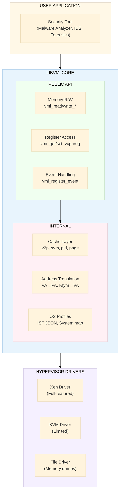

# LibVMI — Architecture, API & Limitations

## Origin & History

LibVMI was originally called **XenAccess**, created by **Bryan D. Payne** in Fall 2005 as a graduate student at Georgia Tech. It was funded through the Early Career LDRD program at **Sandia National Laboratories** (Sandia Report SAND2012-7818). It was renamed from XenAccess to LibVMI to support multiple hypervisors beyond Xen. The project is now co-maintained by **Tamas K. Lengyel** (Zentific LLC), who is also the creator of DRAKVUF.

## Architecture



## Core API Reference

### Initialization & Lifecycle

```c
// Basic init — memory access only
status_t vmi_init(vmi_instance_t *vmi, vmi_mode_t mode, const void *domain,
                  uint64_t init_flags, vmi_init_data_t *init_data,
                  vmi_init_error_t *error);

// Full init — with OS profile loading for kernel-aware introspection
status_t vmi_init_complete(vmi_instance_t *vmi, const void *domain,
                           uint64_t init_flags, vmi_init_data_t *init_data,
                           vmi_config_t config_mode, void *config,
                           vmi_init_error_t *error);

// Cleanup
status_t vmi_destroy(vmi_instance_t vmi);
```

### Memory Access

Three abstraction levels, each with typed variants (8/16/32/64-bit, addr, string, unicode):

| Access Method | Read Function | Write Function | Use Case |
|---------------|--------------|----------------|----------|
| **Physical Address** | `vmi_read_pa()` | `vmi_write_pa()` | Direct hardware-level access |
| **Virtual Address** | `vmi_read_va(vmi, vaddr, pid, ...)` | `vmi_write_va()` | Process memory access |
| **Kernel Symbol** | `vmi_read_ksym(vmi, "PsInitialSystemProcess", ...)` | `vmi_write_ksym()` | Kernel data structure access |
| **Generic** | `vmi_read(vmi, &ctx, count, buf, &bytes_read)` | `vmi_write()` | Unified API with `access_context_t` |

```c
// Typed read examples
status_t vmi_read_32_va(vmi, vaddr, pid, &value);
status_t vmi_read_64_pa(vmi, paddr, &value);
status_t vmi_read_str_va(vmi, vaddr, pid, &str);           // NULL-terminated string
status_t vmi_read_unicode_str_va(vmi, vaddr, pid, &ustr);  // Windows UNICODE_STRING

// Map guest pages directly into host address space
void* vmi_mmap_guest(vmi, &ctx, count);
```

### Address Translation

```c
status_t vmi_translate_kv2p(vmi, vaddr, &paddr);       // kernel VA → PA
status_t vmi_translate_uv2p(vmi, vaddr, pid, &paddr);  // user VA → PA
status_t vmi_translate_ksym2v(vmi, "symbol", &vaddr);   // kernel symbol → VA
status_t vmi_pid_to_dtb(vmi, pid, &dtb);               // PID → page directory base
status_t vmi_dtb_to_pid(vmi, dtb, &pid);               // reverse lookup
status_t vmi_pagetable_lookup(vmi, pt, vaddr, &paddr); // manual page table walk

// Extended page table (EPT/NPT) translation
status_t vmi_nested_pagetable_lookup(vmi, npt, npm, pt, pm, vaddr, &paddr, &naddr);
```

### Event Handling (Xen Only)

**Event types** (`vmi_event_type_t`):

| Event Type | Description | Typical Use |
|-----------|-------------|-------------|
| `VMI_EVENT_MEMORY` | R/W/X on memory region | Monitor code execution, data access |
| `VMI_EVENT_REGISTER` | CR0/CR3/CR4/MSR changes | Track process switches (CR3) |
| `VMI_EVENT_SINGLESTEP` | Single instruction step per vCPU | Instruction-level tracing |
| `VMI_EVENT_INTERRUPT` | Interrupt delivery (INT3) | Software breakpoints |
| `VMI_EVENT_CPUID` | CPUID instruction | Detect feature queries |
| `VMI_EVENT_DEBUG_EXCEPTION` | Hardware debug exceptions | Hardware breakpoints |
| `VMI_EVENT_DESCRIPTOR_ACCESS` | GDT/LDT/IDT/TR access | Detect rootkit hooking |
| `VMI_EVENT_GUEST_REQUEST` | Guest-initiated VMI request | Cooperative introspection |

```c
// Event structure
typedef struct vmi_event {
    vmi_event_type_t type;
    union {
        reg_event_t          reg_event;
        mem_access_event_t   mem_event;
        single_step_event_t  ss_event;
        interrupt_event_t    interrupt_event;
    };
    event_callback_t callback;  // function pointer
} vmi_event_t;

// Callback signature
typedef event_response_t (*event_callback_t)(vmi_instance_t vmi, vmi_event_t *event);

// Event API
status_t vmi_register_event(vmi, &event);
status_t vmi_clear_event(vmi, &event, free_routine);
status_t vmi_events_listen(vmi, timeout_ms);
status_t vmi_step_event(vmi, &event, vcpu_id, steps, cb);
```

### VM Control & Register Access

```c
status_t vmi_pause_vm(vmi);
status_t vmi_resume_vm(vmi);
status_t vmi_get_vcpureg(vmi, &value, reg, vcpu);
status_t vmi_get_vcpuregs(vmi, &regs, vcpu);
status_t vmi_set_vcpureg(vmi, value, reg, vcpu);
status_t vmi_request_page_fault(vmi, vcpu, va, error_code);
```

### Cache Management

LibVMI maintains multiple caches for performance:

| Cache | Flush | Add | Purpose |
|-------|-------|-----|---------|
| **v2p** | `vmi_v2pcache_flush()` | `vmi_v2pcache_add()` | Virtual-to-physical translations |
| **Symbol** | `vmi_symcache_flush()` | `vmi_symcache_add()` | Symbol-to-address mappings |
| **RVA** | `vmi_rvacache_flush()` | `vmi_rvacache_add()` | RVA-to-symbol reverse lookups |
| **PID** | `vmi_pidcache_flush()` | `vmi_pidcache_add()` | PID-to-DTB mappings |
| **Page** | `vmi_pagecache_flush()` | — | Mapped physical pages |

### OS Profile Support

```c
os_t vmi_get_ostype(vmi);                     // VMI_OS_WINDOWS, VMI_OS_LINUX, VMI_OS_FREEBSD
const char* vmi_get_os_profile_path(vmi);
status_t vmi_get_offset(vmi, "win_tasks", &offset);
status_t vmi_get_kernel_struct_offset(vmi, "EPROCESS", "ActiveProcessLinks", &offset);
win_ver_t vmi_get_winver(vmi);
bool vmi_get_windows_build_info(vmi, &info);
```

Supports **Volatility3 IST JSON** (current standard) and Rekall profiles (deprecated).

---

## Limitations & Known Issues

### Technical Limitations

| Limitation | Impact | Severity |
|-----------|--------|----------|
| **Events are Xen-only** | Most powerful feature unavailable on KVM | Critical |
| **KVM support immature** | KVMi patches not upstream in mainline Linux | High |
| **No 5-level paging (LA57)** | Cannot introspect modern 57-bit VA guests | Medium |
| **Linux host only** | No Windows/macOS host support for live introspection | Medium |
| **Semantic gap** | Requires OS-specific profiles matching exact kernel version | Medium |
| **Performance overhead** | Pausing VMs creates observable side effects | Medium |
| **No thread safety** | Single-threaded event loop | High for production |

### Project Health Concerns

| Concern | Detail |
|---------|--------|
| **Last release** | v0.14.0 — December 2020 (5+ years ago) |
| **Open issues** | 91 unresolved |
| **Open PRs** | 6 pending |
| **Total commits** | 1,585 (slow growth) |
| **Active maintainers** | 1-2 (Lengyel primarily) |
| **Dependencies** | glib, libvirt, libjson-c — heavy C dependency chain |

### Known GitHub Issues

| Issue | Description |
|-------|-------------|
| #866 | Slow VM performance on KVM (Windows guest) |
| #573 | `vmi_events_listen` failures |
| #377 | `vmi_step_event` fails to clear single-step events |
| #694 | Failed to read port from event channel |
| #321 | KVM support build difficulties with libvirt |

---

## Related Projects

### Dynamic Analysis

| Project | Description | Relationship to LibVMI |
|---------|-------------|----------------------|
| **[DRAKVUF](https://drakvuf.com/)** | Black-box binary analysis on Xen | Primary consumer of LibVMI |
| **[PyREBox](https://github.com/Cisco-Talos/pyrebox)** | Python-scriptable RE sandbox | Cisco Talos, QEMU-based |
| **[PANDA](https://github.com/panda-re/panda)** | Architecture-neutral dynamic analysis | Record/replay |
| **[DECAF](https://github.com/decaf-project/DECAF)** | Dynamic executable code analysis | QEMU-based |

### Memory Forensics

| Project | Description | Relationship |
|---------|-------------|-------------|
| **[Volatility3](https://github.com/volatilityfoundation/volatility3)** | Memory forensics framework | Provides IST JSON profiles for LibVMI |
| **[MemProcFS](https://github.com/ufrisk/MemProcFS)** | Memory as virtual filesystem | Alternative approach to VMI |
| **[AVML](https://github.com/microsoft/avml)** | Volatile memory acquisition (Rust) | Acquisition tool, feeds into forensics |

### Hypervisor Security

| Project | Description |
|---------|-------------|
| **[HVMI](https://github.com/bitdefender/bddisasm)** | Bitdefender's Hypervisor Memory Introspection |
| **[KVM-VMI](https://github.com/KVM-VMI/kvm-vmi)** | KVM fork with VMI patches |

## References

- [LibVMI GitHub](https://github.com/libvmi/libvmi)
- [LibVMI API Documentation](https://libvmi.com/api/)
- [Sandia Report: Simplifying VMI Using LibVMI (SAND2012-7818)](https://www.osti.gov/servlets/purl/1055635)
- [ACSAC 2014: Introduction to VMI Using LibVMI](https://www.acsac.org/2014/workshops/mmf/)
- [Wikipedia: Virtual Machine Introspection](https://en.wikipedia.org/wiki/Virtual_machine_introspection)
