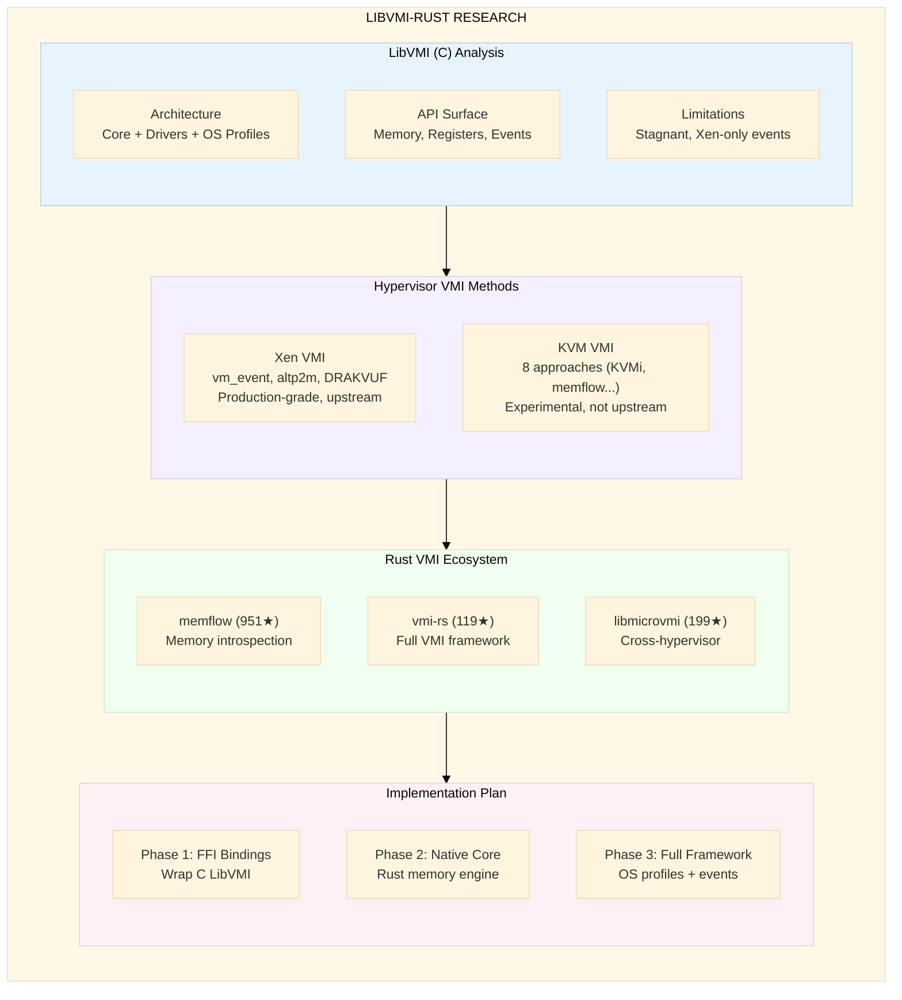

# LibVMI-Rust — Research Mindmap

```mermaid
%%{init: {'theme': 'base', 'themeVariables': { 'fontSize': '14px' }, 'flowchart': { 'useMaxWidth': true }}}%%
flowchart TB
    subgraph Root["LIBVMI-RUST RESEARCH"]
        direction TB

        subgraph LibVMI["LibVMI (C) Analysis"]
            direction TB
            L1["Architecture\nCore + Drivers + OS Profiles"]
            L2["API Surface\nMemory, Registers, Events"]
            L3["Limitations\nStagnant, Xen-only events"]
        end

        subgraph Hypervisors["Hypervisor VMI Methods"]
            direction TB
            H1["Xen VMI\nvm_event, altp2m, DRAKVUF\nProduction-grade, upstream"]
            H2["KVM VMI\n8 approaches (KVMi, memflow...)\nExperimental, not upstream"]
        end

        subgraph Ecosystem["Rust VMI Ecosystem"]
            direction TB
            E1["memflow (951★)\nMemory introspection"]
            E2["vmi-rs (119★)\nFull VMI framework"]
            E3["libmicrovmi (199★)\nCross-hypervisor"]
        end

        subgraph Plan["Implementation Plan"]
            direction TB
            P1["Phase 1: FFI Bindings\nWrap C LibVMI"]
            P2["Phase 2: Native Core\nRust memory engine"]
            P3["Phase 3: Full Framework\nOS profiles + events"]
        end

        LibVMI --> Hypervisors
        Hypervisors --> Ecosystem
        Ecosystem --> Plan
    end

    style Root fill:#FFF8E7,stroke:#E6DDD0,stroke-width:1px
    style LibVMI fill:#E8F4FD,stroke:#B8D4ED,stroke-width:1px
    style Hypervisors fill:#F5F0FF,stroke:#D8D0E8,stroke-width:1px
    style Ecosystem fill:#F0FFF0,stroke:#D0E8D0,stroke-width:1px
    style Plan fill:#FFF0F5,stroke:#E8D0D8,stroke-width:1px
```
