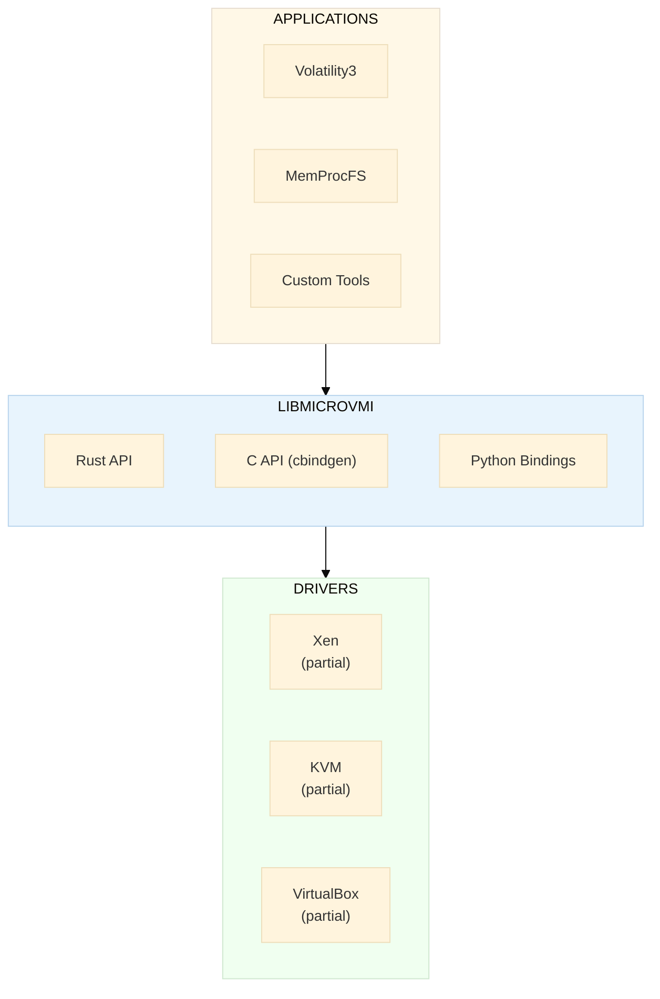
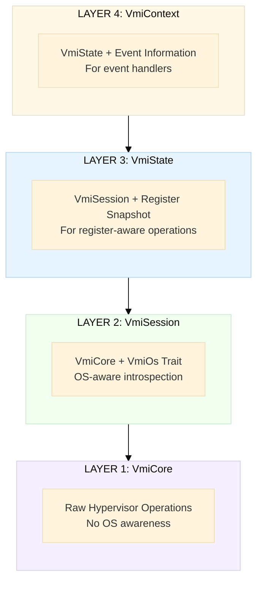

# Rust VMI Ecosystem — Frameworks, Crates & Tools

## Landscape Overview

The Rust VMI ecosystem is maturing rapidly. Three major frameworks have emerged, each with different design philosophies:

```mermaid
%%{init: {'theme': 'base', 'themeVariables': { 'fontSize': '14px' }, 'flowchart': { 'useMaxWidth': true }}}%%
flowchart TB
    subgraph Tier1["TIER 1: MAJOR FRAMEWORKS"]
        direction TB
        MF["memflow (951★)\nPlugin-based memory introspection\nQEMU, KVM, PCILeech"]
        MICRO["libmicrovmi (199★)\nUnified cross-hypervisor API\nXen, KVM, VBox, memflow"]
        VMIRS["vmi-rs (119★)\nFull VMI framework\nXen 4.20+, ISR profiles"]
    end

    subgraph Tier2["TIER 2: BINDINGS & WRAPPERS"]
        direction TB
        KVMI["kvmi (5★)\nlibkvmi Rust bindings"]
        LVMI["libvmi-rs (4★)\nLibVMI reimplementation"]
        MARK["mark-i-m/vmi-rs\nSimple LibVMI wrapper"]
    end

    subgraph Tier3["TIER 3: HYPERVISOR TOOLS"]
        direction TB
        ILL["illusion-rs (350★)\nType-1 hypervisor\nEPT hooking (Archived)"]
        MAT["matrix-rs\nType-2 hypervisor\nDual-EPT switching"]
        AVML["AVML (1,100★)\nMemory acquisition\nMicrosoft"]
    end

    style Tier1 fill:#FFF8E7,stroke:#E6DDD0,stroke-width:1px
    style Tier2 fill:#E8F4FD,stroke:#B8D4ED,stroke-width:1px
    style Tier3 fill:#F0FFF0,stroke:#D0E8D0,stroke-width:1px
```

---

## Tier 1: Major Frameworks

### memflow — Memory Introspection Framework

| Field | Value |
|-------|-------|
| **Repository** | https://github.com/memflow/memflow |
| **Stars** | 951 |
| **License** | MIT |
| **Last Release** | v0.2.3 (July 2024) |
| **Crate** | `memflow` on crates.io |
| **Rust MSRV** | 1.82.0+ |

**Architecture**: Plugin-based connector system — connectors (QEMU, KVM, PCILeech, Coredump) are loaded at runtime as shared libraries.

**Key Features**:
- Throughput-optimized V2P translation (walks entire process VA space in <1 second)
- Batchable/divisible memory interface with integrated caching
- C ABI compatibility for cross-language use (C, C++, Zig)
- Cross-platform: Linux/macOS/Windows x86_64, Linux ARM64/ARMv7, `no_std`
- Installer tool: `memflowup`

**Official Connectors**:

| Connector | Hypervisor | Features |
|-----------|-----------|----------|
| `memflow-qemu` | QEMU | Memory access via QEMU socket |
| `memflow-kvm` | KVM | Direct `/dev/kvm` access |
| `memflow-pcileech` | Hardware | DMA-based memory access |
| `memflow-coredump` | N/A | Offline memory dump analysis |
| `memflow-win32` | Windows | OS layer for process/module enumeration |

**Best For**: High-throughput memory scanning, game hacking research, cross-platform memory analysis.

---

### libmicrovmi — Unified VMI API

| Field | Value |
|-------|-------|
| **Repository** | https://github.com/Wenzel/libmicrovmi |
| **Stars** | 199 |
| **Commits** | 844 |
| **License** | GPL-3.0 |
| **Last Release** | v0.4.0 (December 2025) |
| **Crate** | `microvmi` on crates.io |
| **Author** | Mathieu Tarral (@Wenzel) |

**Goal**: Solve VMI ecosystem fragmentation with a single API across all hypervisors.

**Architecture**:

**Key Features**:
- Multi-language bindings: Rust (primary), C (via cbindgen), Python
- Integration with MemProcFS, Volatility3, LibVMI
- Presented at **FOSDEM 2020**: "Rustifying the Virtual Machine Introspection ecosystem"

**Best For**: Building tools that need to work across multiple hypervisors with a single API.

---

### vmi-rs — Full VMI Framework

| Field | Value |
|-------|-------|
| **Repository** | https://github.com/vmi-rs/vmi |
| **Stars** | 119 |
| **Commits** | 142 |
| **License** | MIT |
| **Version** | 0.4.0 (early stage) |
| **Crate** | `vmi` on crates.io |

**Architecture**: Layered abstraction with four levels:

**Key Features**:
- **Type-safe addresses**: `Va` (virtual), `Pa` (physical), `Gfn` (guest frame number) — prevents mixing address types
- **ISR (Intermediate Symbol Representation)**: Version-agnostic OS introspection without hardcoded offsets
- **Modular traits**: `VmiDriver`, `VmiOs`, `VmiHandler`, `Architecture`, `Registers`
- **Built-in utilities**: `BreakpointManager`, `PageTableMonitor`, `InjectorHandler`

**Supported**:
- Hypervisors: Xen 4.20+ only
- CPU: AMD64 only
- OS: Windows 7+ (well-tested), Linux (limited)
- Offline: KdmpDriver, XenCoreDumpDriver

**Limitations**: No x86-32, no 5-level paging, Xen-only, early stage with breaking changes expected.

**Best For**: Building comprehensive VMI tools on Xen with modern Rust patterns.

---

## Tier 2: Bindings & Wrappers

| Project | URL | Stars | Description |
|---------|-----|-------|-------------|
| **kvmi** | https://github.com/Wenzel/kvmi | 5 | Safe Rust bindings for libkvmi (KVM introspection), v0.5.0, active |
| **kvmi-sys** | https://github.com/Wenzel/kvmi-sys | — | Raw FFI bindings for libkvmi |
| **libvmi-rs** | https://github.com/Wenzel/libvmi-rs | 4 | Rust reimplementation of LibVMI (early stage, minimal activity) |
| **mark-i-m/vmi-rs** | https://github.com/mark-i-m/vmi-rs | — | Simple LibVMI wrapper using bindgen (very incomplete) |
| **xenstore-rs** | https://github.com/Wenzel/xenstore | — | Rust bindings to Xenstore |

---

## Rust Hypervisor Interaction Libraries

### rust-vmm Organization

The **rust-vmm** project provides shared building blocks used by Cloud Hypervisor, Firecracker, and crosvm:

| Crate | Repository | Purpose |
|-------|-----------|---------|
| **kvm-bindings** | https://github.com/rust-vmm/kvm-bindings | FFI bindings to KVM kernel headers |
| **kvm-ioctls** | https://github.com/rust-vmm/kvm-ioctls | Safe wrappers over KVM ioctl API |
| **vm-memory** | https://github.com/rust-vmm/vm-memory | Guest memory abstractions |
| **xen** | https://github.com/rust-vmm/xen | Pure Rust Xen hypercall interfaces |
| **xen-sys** | https://github.com/rust-vmm/xen-sys | Low-level Xen FFI bindings |
| **mshv** | https://github.com/rust-vmm/mshv | Microsoft Hypervisor (Hyper-V) ioctls |
| **vmm-sys-util** | https://github.com/rust-vmm/vmm-sys-util | Helper utilities for VMMs |
| **linux-loader** | https://github.com/rust-vmm/linux-loader | Kernel image parser |
| **vm-device** | https://github.com/rust-vmm/vm-device | Virtual device model |
| **event-manager** | https://github.com/rust-vmm/event-manager | Event-based system abstractions |
| **vhost** | https://github.com/rust-vmm/vhost | Vhost backend driver framework |

### Production Rust VMMs

| VMM | Creator | Use Case | rust-vmm Crates Used |
|-----|---------|----------|---------------------|
| **Cloud Hypervisor** | Intel/Linux Foundation | General cloud VMs | kvm-ioctls, vm-memory, vfio |
| **Firecracker** | Amazon | Serverless/containers | kvm-ioctls, vm-memory |
| **crosvm** | Google | ChromeOS VM isolation | kvm-ioctls, vm-memory |

### QEMU Interaction

| Crate | URL | Purpose |
|-------|-----|---------|
| **qapi-rs** | https://github.com/arcnmx/qapi-rs | QEMU QMP and Guest Agent protocol |
| **qemu-rs** | https://github.com/novafacing/qemu-rs | QEMU TCG plugin building in Rust |
| **libafl_qemu** | crates.io | QEMU user backend for LibAFL fuzzer |

---

## Essential Rust Crates for VMI Development

### Core System Interaction

| Crate | Downloads/mo | Purpose |
|-------|-------------|---------|
| `libc` | Top 10 | Raw FFI bindings to platform C libraries |
| `nix` | 29.8M | Safe *nix API wrappers (syscalls, mmap, ptrace, signals) |
| `memmap2` | High | Cross-platform memory-mapped file I/O |

### Binary Parsing & Data Handling

| Crate | Purpose | VMI Use |
|-------|---------|---------|
| `goblin` | ELF/PE/Mach-O parser | Parse guest kernel and module binaries |
| `pdb` | Windows PDB symbol parser | Extract struct offsets for Windows introspection |
| `zerocopy` | Zero-copy binary struct parsing | Parse kernel structures from raw memory |
| `scroll` | Endian-aware binary read/write | Read typed values from guest memory |
| `byteorder` | Big/little endian integers | Cross-architecture memory parsing |
| `bitflags` | Type-safe bit flags | CPU flags, page table bits, event masks |

### FFI & Build Tools

| Crate | Purpose | VMI Use |
|-------|---------|---------|
| `bindgen` | Generate Rust FFI from C headers | Wrap libvmi, libxenctrl, libkvmi |
| `cc` | Compile C/C++ in build.rs | Build vendored C dependencies |
| `cbindgen` | Generate C headers from Rust | Expose Rust VMI API to C consumers |

### Error Handling & Logging

| Crate | Purpose |
|-------|---------|
| `thiserror` | Derive macro for error types |
| `anyhow` | Flexible error handling for applications |
| `tracing` | Structured logging and instrumentation |
| `log` | Lightweight logging facade |

---

## Research Papers & Talks

| Title | Author | Year | Key Contribution |
|-------|--------|------|-----------------|
| **Rustifying the VMI Ecosystem** | Mathieu Tarral | FOSDEM 2020 | Introduced libmicrovmi; argued Rust ideal for VMI (safety + speed) |
| **Bridging the Semantic Gap in VMI** | Fellicious et al. | 2025 | ML-based memory interpretation; 1TB+ public dataset |
| **Hypervisors for Memory Introspection and RE** | memN0ps | 2025 | illusion-rs/matrix-rs: EPT hooking, dual-EPT, SSDT hooks in Rust |
| **Making Rust First-Class for Xen** | XCP-ng | 2024 | Upstream effort for pure-Rust Xen hypercalls |
| **RapidVMI** | ACM ARES | 2021 | Multi-core VMI challenges and parallel event processing |

### Key Links

- [FOSDEM 2020 Slides (PDF)](https://archive.fosdem.org/2020/schedule/event/rust_vm_introspection/attachments/slides/4104/export/events/attachments/rust_vm_introspection/slides/4104/Rustifying_the_VM_Introspection_Ecosystem.pdf)
- [FOSDEM 2020 Video](https://av.tib.eu/media/47423)
- [Semantic Gap Paper (arXiv)](https://arxiv.org/abs/2503.05482)
- [VMI Ecosystem Fragmentation](https://wenzel.github.io/libmicrovmi/explanation/vmi_ecosystem.html)

---

## Ecosystem Comparison Matrix

| Feature | memflow | libmicrovmi | vmi-rs | LibVMI (C) |
|---------|---------|------------|--------|-----------|
| **Language** | Rust | Rust | Rust | C |
| **Memory R/W** | Yes | Yes | Yes | Yes |
| **Register Access** | No | Partial | Yes | Yes |
| **Event Handling** | No | Partial | Yes (Xen) | Yes (Xen) |
| **Xen Support** | No | Partial | Full | Full |
| **KVM Support** | Yes (connector) | Partial | No | Partial |
| **QEMU Support** | Yes (connector) | Via memflow | No | No |
| **VirtualBox** | No | Partial | No | No |
| **Offline Dumps** | Yes | Yes | Yes | Yes |
| **OS Profiles** | Win32 layer | Via volatility3 | ISR (native) | IST JSON |
| **C Bindings** | Yes (ABI) | Yes (cbindgen) | No | Native |
| **Python Bindings** | No | Yes | No | Yes (PyVMI) |
| **Plugin System** | Yes (runtime) | Yes (compile) | Yes (traits) | No |
| **Thread Safety** | Partial | Partial | Partial | No |
| **Active Development** | Yes | Yes | Yes | Stagnant |
